# Tutorial: Health_System_API

This project is a basic API for a **Health System**.
It allows managing core health-related *data*, like information about patients, doctors, appointments, medical records, billing, and prescriptions.
The API provides *endpoints* for performing standard operations (like adding, retrieving, updating, and deleting) on this health data.


## Visual Overview

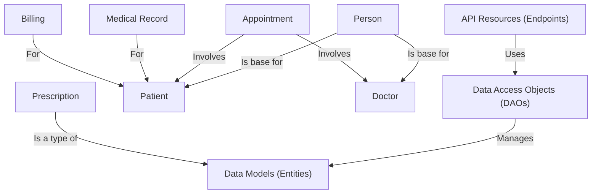

## Chapters

1. [API Resources (Endpoints)
](01_api_resources__endpoints__.md)
2. [Data Models (Entities)
](02_data_models__entities__.md)
3. [Person
](03_person_.md)
4. [Patient
](04_patient_.md)
5. [Doctor
](05_doctor_.md)
6. [Appointment
](06_appointment_.md)
7. [Medical Record
](07_medical_record_.md)
8. [Billing
](08_billing_.md)
9. [Prescription
](09_prescription_.md)
10. [Data Access Objects (DAOs)
](10_data_access_objects__daos__.md)

---

<sub><sup>Generated by [AI Codebase Knowledge Builder](https://github.com/The-Pocket/Tutorial-Codebase-Knowledge).</sup></sub>

# Chapter 1: API Resources (Endpoints)

Welcome to the first chapter of our tutorial on the `Health_System_API` project! If you're new to building APIs, this is the perfect place to start. We're going to learn about the entry points of our API, which we call "API Resources" or "Endpoints".

Think of our Health System API like a restaurant. You, the client (maybe a mobile app or a website), want to get or update health information. But you can't just walk into the kitchen (our database) and grab what you need! You need to interact through the restaurant's service.

In our API restaurant, the "API Resources" are like the menu items and the waiters who take your order and bring your food. They define *what* you can ask for (like getting patient data, booking an appointment, or adding a new doctor) and *how* you should ask for it.

### What is an API Endpoint?

An **Endpoint** is essentially a specific address on our server that you can access. It's a combination of a URL (like `/patients` or `/doctors/123`) and an HTTP method (like GET, POST, PUT, or DELETE).

These combinations tell our API what you want to do:

*   `GET /patients`: "Please give me a list of all patients."
*   `GET /doctors/123`: "Please give me the details of the doctor with ID 123."
*   `POST /appointments`: "I want to add a new appointment. Here are the details."
*   `DELETE /medical-records/5`: "Please delete the medical record with index 5."

### How Our API Uses Resources (Classes)

In our `Health_System_API`, we organize these endpoints using Java classes. These classes are called **Resource Classes**. Each Resource Class usually handles requests for a specific type of information or entity, like all `Patient` related operations or all `Appointment` operations.

Look inside the `src/main/java/com/example/resource` folder. You'll see files like `PatientResource.java`, `DoctorResource.java`, `AppointmentResource.java`, etc. Each of these files defines a Resource Class responsible for handling requests related to that specific area of the health system.

### Connecting URLs and Methods with JAX-RS Annotations

How do we tell our Java classes which URL paths and HTTP methods they should respond to? We use special markers called **annotations** from a standard Java technology called JAX-RS (Java API for RESTful Web Services).

Let's look at an example from the `PatientResource.java` file:

```java
package com.example.resource;

import com.example.dao.PatientDAO; // We'll learn about DAOs later
import com.example.model.Patient; // We'll learn about Models later
import org.slf4j.Logger;
import org.slf4j.LoggerFactory;

import javax.ws.rs.*; // This package contains the JAX-RS annotations
import javax.ws.rs.core.MediaType;
import javax.ws.rs.core.Response;
import java.util.List;

@Path("/patients") // This annotation sets the base path for this resource
@Produces(MediaType.APPLICATION_JSON) // This says this resource will usually send back JSON
@Consumes(MediaType.APPLICATION_JSON) // This says this resource expects to receive JSON
public class PatientResource {
    // ... (rest of the class)
}
```

*   `@Path("/patients")`: This annotation on the class level tells the API framework that any request starting with `/patients` should potentially be handled by this `PatientResource` class.
*   `@Produces(MediaType.APPLICATION_JSON)`: This means that the methods in this class will typically send data back to the client formatted as JSON (JavaScript Object Notation), which is a common way to exchange data over the internet.
*   `@Consumes(MediaType.APPLICATION_JSON)`: This means that if a method in this class expects to receive data from the client (like when adding a new patient), it expects that data to be in JSON format.

Now let's look at some methods inside the `PatientResource` class:

```java
// GET method to retrieve all patients
@GET // This annotation marks the method to handle GET requests
public Response getAllPatients() {
    // This method handles GET requests to /patients
    // It will fetch all patients using the PatientDAO (Data Access Object)
    // and return them as a JSON list.
    // ... (implementation details)
    return Response.ok(patients).build(); // Returns a successful response with patient data
}

// GET method to retrieve a patient by ID
@GET // This marks the method to handle GET requests
@Path("/{id}") // This adds a dynamic path segment to the base path (/patients)
public Response getPatientById(@PathParam("id") int id) {
    // This method handles GET requests to paths like /patients/123
    // The number '123' is captured by @PathParam("id") and passed as the 'id' argument
    // It uses the PatientDAO to find the specific patient.
    // ... (implementation details)
    if (patient != null) {
        return Response.ok(patient).build(); // Returns the patient if found
    } else {
        return Response.status(Response.Status.NOT_FOUND).entity("Patient Not Found").build(); // Returns 404 if not found
    }
}
```

*   `@GET`: This annotation on a method indicates that this method should be called when a client makes an HTTP `GET` request. `GET` requests are typically used to retrieve data.
*   `@Path("/{id}")`: When combined with the class-level `@Path("/patients")`, this means this method handles requests to `/patients/{id}`, where `{id}` is a variable part of the URL.
*   `@PathParam("id")`: This annotation on a method parameter (`int id`) tells the framework to take the value from the `{id}` part of the URL and pass it to this method as the `id` argument.
*   `Response`: The methods return a `Response` object. This object contains everything needed for the API's reply, including the status code (like 200 OK, 404 Not Found, 500 Internal Server Error) and the data to send back.

Here are the other common HTTP method annotations you'll see in the code:

| Annotation | HTTP Method | Typical Use Case                    |
| :--------- | :---------- | :---------------------------------- |
| `@POST`    | POST        | Create new data (e.g., Add a new patient) |
| `@PUT`     | PUT         | Update existing data                |
| `@DELETE`  | DELETE      | Remove data                         |

Let's look at one more example from `AppointmentResource.java`:

```java
// POST method to add a new appointment
@POST // This marks the method to handle POST requests
public Response addAppointment(Appointment appointment) {
    // This method handles POST requests to /appointments
    // It expects the details of the new appointment in the request body (as JSON, due to @Consumes)
    // The framework automatically converts the JSON body into an Appointment object.
    // ... (implementation details)
    return Response.status(Response.Status.CREATED).entity("Appointment Created Successfully").build(); // Returns 201 Created
}
```

*   `@POST`: Handles `POST` requests, typically used for creating new resources.
*   `addAppointment(Appointment appointment)`: This method receives an `Appointment` object as an argument. Because of the class-level `@Consumes(MediaType.APPLICATION_JSON)`, the API framework will automatically try to convert the incoming JSON data from the client request body into a Java `Appointment` object and pass it to this method.

### How It Works (Under the Hood)

When a client (like your web browser or a mobile app) makes a request to our API, here's a simplified step-by-step flow of what happens:

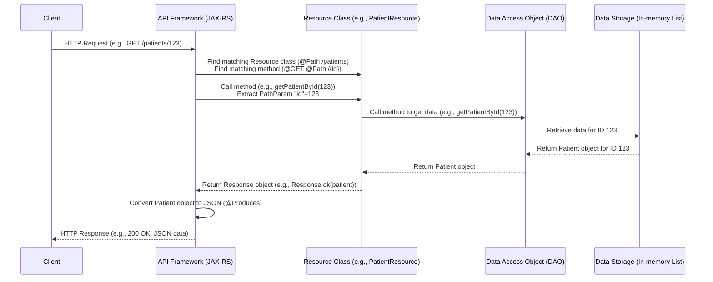

1.  The client sends an HTTP request to the API's address with a specific path and method (e.g., `GET /patients/123`).
2.  The API framework (like JAX-RS/Jersey, running on a server) receives the request.
3.  It looks at the requested path (`/patients/123`) and the HTTP method (`GET`).
4.  It scans the available Resource classes and their methods, looking for one that matches the path and method using the `@Path` and method annotations (`@GET`, `@POST`, etc.).
5.  In this example, it finds the `getPatientById` method in the `PatientResource` class. The `@Path("/{id}")` matches the `/123` part.
6.  The framework extracts the value `123` from the path using `@PathParam("id")` and calls the `getPatientById` method, passing `123` as the `id`.
7.  The `getPatientById` method then uses a [Data Access Object (DAO)](10_data_access_objects__daos__.md) (we'll learn about these later!) to retrieve the patient data, often from some kind of data storage.
8.  The method receives the data (or `null` if not found) and constructs a `Response` object.
9.  The framework takes the `Response` object. If there's a Java object payload (like a `Patient` object), it converts it into the specified format (JSON, because of `@Produces`).
10. Finally, the framework sends the HTTP response back to the client, including the status code and the JSON data.

### Summary

API Resources, defined by Java classes annotated with JAX-RS annotations like `@Path`, `@GET`, `@POST`, `@PUT`, and `@DELETE`, act as the public interface of our API. They map specific URL paths and HTTP methods to Java methods that handle incoming requests. These methods interact with other parts of the system (like [Data Access Objects (DAOs)](10_data_access_objects__daos__.md) and [Data Models (Entities)](02_data_models__entities__.md)) to process the request and send back a structured response, typically in JSON format.

In the next chapter, we'll look at the [Data Models (Entities)](02_data_models__entities__.md), which define the structure of the data (like Patient, Doctor, Appointment) that these resources send and receive.

[Next Chapter: Data Models (Entities)](02_data_models__entities__.md)

---

<sub><sup>Generated by [AI Codebase Knowledge Builder](https://github.com/The-Pocket/Tutorial-Codebase-Knowledge).</sup></sub> <sub><sup>**References**: [[1]](https://github.com/Sehandu-Siriwardhana/Health_System_API/blob/9702cb3b830e63aa140ddd0c21adac901ed05067/src/main/java/com/example/resource/AppointmentResource.java), [[2]](https://github.com/Sehandu-Siriwardhana/Health_System_API/blob/9702cb3b830e63aa140ddd0c21adac901ed05067/src/main/java/com/example/resource/BillingResource.java), [[3]](https://github.com/Sehandu-Siriwardhana/Health_System_API/blob/9702cb3b830e63aa140ddd0c21adac901ed05067/src/main/java/com/example/resource/DoctorResource.java), [[4]](https://github.com/Sehandu-Siriwardhana/Health_System_API/blob/9702cb3b830e63aa140ddd0c21adac901ed05067/src/main/java/com/example/resource/MedicalRecordResource.java), [[5]](https://github.com/Sehandu-Siriwardhana/Health_System_API/blob/9702cb3b830e63aa140ddd0c21adac901ed05067/src/main/java/com/example/resource/PatientResource.java), [[6]](https://github.com/Sehandu-Siriwardhana/Health_System_API/blob/9702cb3b830e63aa140ddd0c21adac901ed05067/src/main/java/com/example/resource/PersonResource.java), [[7]](https://github.com/Sehandu-Siriwardhana/Health_System_API/blob/9702cb3b830e63aa140ddd0c21adac901ed05067/src/main/java/com/example/resource/PrescriptionResource.java)</sup></sub>

# Chapter 2: Data Models (Entities)

Welcome back! In [Chapter 1: API Resources (Endpoints)](01_api_resources__endpoints__.md), we learned about the "waiters" and "menu items" of our Health System API – the endpoints that clients use to interact with the system. We saw how resource classes like `PatientResource` handle requests like `/patients`.

But what exactly are these "patients" or "appointments" that the API talks about? How do we represent them inside our Java code? This is where **Data Models**, also known as **Entities**, come in.

### What are Data Models (Entities)?

Think of our API's resources (like `PatientResource`) as services that work with specific types of information: patient information, doctor information, appointment information, and so on.

To work with this information, our program needs a way to structure it. It needs to know that a "patient" has a name, an address, a medical history, and a unique ID. It needs to know that an "appointment" has a date, a time, a patient, and a doctor.

**Data Models** are essentially the **blueprints** for these different types of information. In our Java project, they are represented by simple Java classes.

Imagine building a house. Before you start building, you need blueprints that show the structure: where the walls are, where the doors go, how many rooms there are. Data models are like these blueprints for our data.

### The Purpose of Data Models

Why do we need these blueprints?

1.  **Structure:** They define exactly what pieces of information belong to a specific "thing" (like a patient).
2.  **Organization:** They help keep our code organized by grouping related data together.
3.  **Communication:** They provide a common format for exchanging data between different parts of our application (like between the API resource and the data storage logic) and between the API and the outside world (clients). When our API sends back patient data, it sends it in a structure defined by the `Patient` model, often converted into JSON. When it receives data to create a new appointment, it expects that data to fit the `Appointment` model's structure.

### Where to Find Data Models

In the `Health_System_API` project, you'll find the Data Model classes in the `src/main/java/com/example/model` folder.

Look inside this folder, and you'll see files like:

*   `Patient.java`
*   `Doctor.java`
*   `Appointment.java`
*   `MedicalRecord.java`
*   `Billing.java`
*   `Prescription.java`
*   `Person.java` (A base model used by Patient and Doctor)

Each of these files defines a class that serves as a blueprint for that specific type of data.

### Anatomy of a Simple Data Model Class

Let's look at a simplified version of the `Patient` class from the `src/main/java/com/example/model/Patient.java` file:

```java
package com.example.model;

// We'll talk about Person later, but Patient 'is a' Person
public class Patient extends Person {

    // These are the "attributes" or "properties" of a Patient
    private String medicalHistory;
    private String currentHealthStatus;
    private int id; // Unique identifier for the patient

    // Default constructor (useful when receiving data from API)
    public Patient() {
    }

    // Constructor to create a Patient object with initial data
    // (The 'super' call passes data up to the Person class)
    public Patient(String name, String address, String contact,
                   String medicalHistory, String currentHealthStatus, int id) {
        super(name, address, contact);
        this.medicalHistory = medicalHistory;
        this.currentHealthStatus = currentHealthStatus;
        this.id = id;
    }

    // --- Getters and Setters ---
    // These methods allow other parts of the code (or the API framework)
    // to safely access or change the attributes.

    public int getId() {
        return id;
    }

    public void setId(int id) {
        this.id = id;
    }

    public String getMedicalHistory() {
        return medicalHistory;
    }

    public void setMedicalHistory(String medicalHistory) {
        this.medicalHistory = medicalHistory;
    }

    public String getCurrentHealthStatus() {
        return currentHealthStatus;
    }

    public void setCurrentHealthStatus(String currentHealthStatus) {
        this.currentHealthStatus = currentHealthStatus;
    }

    // ... other getters and setters inherited from Person
}
```

*   **`package com.example.model;`**: This line just tells Java where this file belongs in the project's structure.
*   **`public class Patient extends Person { ... }`**: This declares a class named `Patient`. The `extends Person` part means that a `Patient` is a specific kind of `Person` and automatically gets all the properties (like `name`, `address`, `contact`) that the `Person` class has, plus its own specific ones. We'll look at [Person](03_person_.md) in the next chapter.
*   **`private String medicalHistory;`**: This declares an "attribute" or "property" named `medicalHistory`. It's of type `String` (text) and `private` means only code inside the `Patient` class can directly access it.
*   **`private int id;`**: Another attribute, `id`, which is a number (`int`) to uniquely identify each patient.
*   **Constructors (`public Patient(...)`)**: These are special methods used to create new `Patient` objects. They allow you to set the initial values for the attributes.
*   **Getters and Setters (`getId()`, `setId(int id)`, etc.)**: These are standard methods (following a pattern called JavaBeans) that provide controlled access to the private attributes. `get...()` methods retrieve the value, and `set...()` methods change the value. API frameworks often use these to read data from the object (to turn it into JSON) or write data into the object (from incoming JSON).

This simple class structure is the backbone for defining all the data types in our system.

### How Models Work with API Resources

Remember in Chapter 1 when we saw methods in our resource classes handling requests? Data models are the types of objects these methods often work with.

Consider the `addAppointment` method from `AppointmentResource.java` we saw earlier:

```java
// Inside AppointmentResource.java
@POST
public Response addAppointment(Appointment appointment) {
    // The API framework automatically created an 'Appointment' object
    // from the incoming JSON data, using the Appointment model blueprint.

    // Now we can use this 'appointment' object with its date, time,
    // patient, and doctor properties.
    System.out.println("Received new appointment for date: " + appointment.getDate());

    // ... Logic to save the appointment using a DAO (coming later!)
    // ...
    return Response.status(Response.Status.CREATED).entity("Appointment Created Successfully").build();
}
```

When a client sends a `POST` request to `/appointments` with JSON data describing an appointment, the API framework (thanks to `@Consumes(MediaType.APPLICATION_JSON)`) uses the `Appointment` model blueprint to:

1.  Create an empty `Appointment` object.
2.  Read the property names and values from the incoming JSON (like `"date": "2023-10-27"`, `"time": "10:00"`).
3.  Use the setter methods (`setDate()`, `setTime()`, etc.) on the `Appointment` object to fill it with the data from the JSON.
4.  Pass this fully-formed `Appointment` object to the `addAppointment` method.

Similarly, when a resource method needs to send data back (like getting patient details), it fetches the data, creates a `Patient` object (or a list of them), and returns it in the `Response`. The API framework then uses the getter methods (`getId()`, `getName()`, `getMedicalHistory()`, etc.) on the `Patient` object(s) to read the data and convert it into JSON format for the client (`@Produces(MediaType.APPLICATION_JSON)`).

### Data Flow with Models

Let's revisit the sequence diagram from Chapter 1 and see where the Data Models fit in:

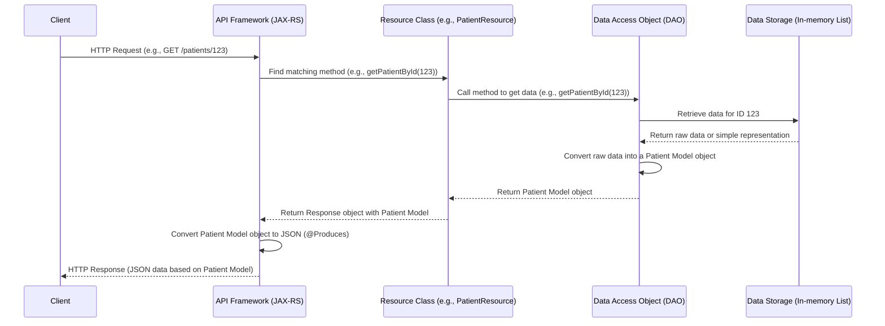

Notice how the `Patient` Model object is created by the [Data Access Object (DAO)](10_data_access_objects__daos__.md) (we'll cover DAOs later) and passed back up through the layers until the API Framework converts it to JSON for the client. Data Models are the standard way data is represented and moved around within our API's internal logic.

### Other Data Models

As you explore the `com.example.model` package, you'll see other blueprints:

*   `Doctor.java`: Defines a doctor with properties like `specialization` (it also extends `Person`).
*   `Appointment.java`: Defines an appointment with `date`, `time`, and references to the `Patient` and `Doctor` involved.
*   `MedicalRecord.java`: Stores a patient's medical history details.
*   `Billing.java`: Represents a patient's billing information, containing a list of `Invoice` objects.
*   `Prescription.java`: Details a medication prescription.
*   `Invoice.java`: A nested class inside `Billing.java` representing a single invoice item.

These models work together to structure all the necessary information for our health system.

### Summary

Data Models (Entities) are fundamental Java classes that act as blueprints, defining the structure and properties of the different types of data used in our `Health_System_API`, such as `Patient`, `Doctor`, and `Appointment`. They provide a consistent way to represent data within the application and facilitate the exchange of information (often as JSON) with external clients via the [API Resources (Endpoints)](01_api_resources__endpoints__.md).

In the following chapters, we will look at some of these specific data models in more detail, starting with the base class, [Person](03_person_.md).

[Next Chapter: Person](03_person_.md)

---

<sub><sup>Generated by [AI Codebase Knowledge Builder](https://github.com/The-Pocket/Tutorial-Codebase-Knowledge).</sup></sub> <sub><sup>**References**: [[1]](https://github.com/Sehandu-Siriwardhana/Health_System_API/blob/9702cb3b830e63aa140ddd0c21adac901ed05067/src/main/java/com/example/model/Appointment.java), [[2]](https://github.com/Sehandu-Siriwardhana/Health_System_API/blob/9702cb3b830e63aa140ddd0c21adac901ed05067/src/main/java/com/example/model/Billing.java), [[3]](https://github.com/Sehandu-Siriwardhana/Health_System_API/blob/9702cb3b830e63aa140ddd0c21adac901ed05067/src/main/java/com/example/model/Doctor.java), [[4]](https://github.com/Sehandu-Siriwardhana/Health_System_API/blob/9702cb3b830e63aa140ddd0c21adac901ed05067/src/main/java/com/example/model/MedicalRecord.java), [[5]](https://github.com/Sehandu-Siriwardhana/Health_System_API/blob/9702cb3b830e63aa140ddd0c21adac901ed05067/src/main/java/com/example/model/Patient.java), [[6]](https://github.com/Sehandu-Siriwardhana/Health_System_API/blob/9702cb3b830e63aa140ddd0c21adac901ed05067/src/main/java/com/example/model/Person.java), [[7]](https://github.com/Sehandu-Siriwardhana/Health_System_API/blob/9702cb3b830e63aa140ddd0c21adac901ed05067/src/main/java/com/example/model/Prescription.java)</sup></sub>

# Chapter 3: Person

Welcome back to the Health System API tutorial! In [Chapter 2: Data Models (Entities)](02_data_models__entities__.md), we explored how we use simple Java classes, like `Patient` and `Appointment`, as blueprints to structure the data in our API. We saw that these models define the properties (attributes) that represent our real-world concepts.

As we looked at the `Patient` class code, you might have noticed something interesting: `public class Patient **extends Person**`. This `extends` keyword hints at a special relationship between `Patient` and another class called `Person`.

### Why Do We Need a `Person` Class?

Imagine you're building models for a health system. You know you need a `Patient` model and a `Doctor` model.

What kind of information does a **Patient** need?
*   Name
*   Address
*   Contact information (phone, email)
*   Unique ID
*   Medical history
*   Current health status
*   ...plus many other patient-specific things

What kind of information does a **Doctor** need?
*   Name
*   Address
*   Contact information (phone, email)
*   Unique ID
*   Specialization
*   License number
*   ...plus many other doctor-specific things

Did you notice the repetition? Both a `Patient` and a `Doctor` have a `Name`, an `Address`, and `Contact` information, and a unique `ID`. If we just created `Patient` and `Doctor` classes separately, we'd have to write the code for these common attributes (like the `private String name;` line and the `getName()`/`setName()` methods) in *both* classes. This is repetitive and makes the code harder to manage. If you decide to add an email address field, you'd have to remember to add it to both `Patient` and `Doctor`.

This is where the **`Person`** class comes in!

The `Person` class is designed to be a **base class** (or **parent class**). It holds all the common attributes that most human beings in our system will have. Think of it as a universal template for basic identity information.

By creating a `Person` class with `name`, `address`, `contact`, and `id`, and then having `Patient` and `Doctor` **extend** (`inherit` from) `Person`, they automatically get these properties without having to write the code again. They can then add their own specific properties (like `medicalHistory` for a `Patient` or `specialization` for a `Doctor`).

This concept is called **Inheritance**, and it's a fundamental idea in object-oriented programming that helps us avoid repetition and build more organized, maintainable code.

### The `Person` Blueprint

Let's look at the blueprint for our generic `Person`. You can find this in the `src/main/java/com/example/model/Person.java` file.

```java
package com.example.model;

/**
 * Represents a basic Person with common attributes.
 */
public class Person {
    // Attributes common to all persons
    private String name;
    private String address;
    private String contact;
    private int id; // Unique identifier

    // Default constructor
    public Person() {
    }

    // Parameterized constructor (sets initial values)
    public Person(String name, String address, String contact) {
        this.name = name;
        this.address = address;
        this.contact = contact;
        // Note: ID is usually set by the system/data layer, not the constructor
    }

    // --- Getters and Setters ---
    public String getName() {
        return name;
    }

    public void setName(String name) {
        this.name = name;
    }

    // ... getters/setters for address, contact, and id ...

    public int getId() {
        return id;
    }

    public void setId(int id) {
        this.id = id;
    }
}
```

As you can see, `Person.java` is a simple class with fields for `name`, `address`, `contact`, and `id`, along with the standard getter and setter methods for accessing and modifying these fields. This is the foundation upon which more specific person types will be built.

### How `Patient` and `Doctor` Inherit from `Person`

Now, let's quickly look at how `Patient` and `Doctor` use this blueprint.

In `src/main/java/com/example/model/Patient.java`, you'll see:

```java
package com.example.model;

public class Patient extends Person { // <--- Here it says Patient is a type of Person!

    private String medicalHistory; // Patient-specific attribute
    private String currentHealthStatus; // Patient-specific attribute

    // Constructor includes Person attributes (passed to 'super')
    public Patient(String name, String address, String contact, // Person attributes
                   String medicalHistory, String currentHealthStatus, int id) {
        super(name, address, contact); // Calls the Person constructor
        this.medicalHistory = medicalHistory;
        this.currentHealthStatus = currentHealthStatus;
        this.setId(id); // Sets the ID inherited from Person
    }

    // Patient-specific getters/setters
    public String getMedicalHistory() { ... }
    public void setMedicalHistory(String medicalHistory) { ... }
    // ... and getters/setters inherited from Person are also available!
}
```

And similarly, in `src/main/java/com/example/model/Doctor.java`:

```java
package com.example.model;

public class Doctor extends Person { // <--- Doctor is also a type of Person!

    private String specialization; // Doctor-specific attribute
    private String licenseNumber;  // Doctor-specific attribute

    // Constructor includes Person attributes
    public Doctor(String name, String address, String contact, // Person attributes
                  String specialization, String licenseNumber, int id) {
        super(name, address, contact); // Calls the Person constructor
        this.specialization = specialization;
        this.licenseNumber = licenseNumber;
        this.setId(id); // Sets the ID inherited from Person
    }

    // Doctor-specific getters/setters
    public String getSpecialization() { ... }
    public void setSpecialization(String specialization) { ... }
    // ... and getters/setters inherited from Person are also available!
}
```

The `extends Person` keyword means that a `Patient` object *is* also a `Person` object. It automatically has access to the `name`, `address`, `contact`, and `id` attributes and their methods (`getName()`, `setAddress()`, etc.) as if they were declared directly in the `Patient` class. This saves us from repeating code.

### Using the `Person` Model in the API

Although `Person` is primarily a base class for `Patient` and `Doctor`, our API project also includes a basic `/persons` endpoint and a `PersonDAO` to manage generic `Person` objects directly. This helps illustrate how the base class works and provides a simple way to interact with the common attributes.

Let's imagine a simple use case: You want to get the basic contact information for *any* person in the system, regardless of whether they are a patient or a doctor, using their unique ID. You can use the `/persons` endpoint for this.

### How It Works Under the Hood (`GET /persons/{id}`)

When a client makes a request like `GET /persons/123`, here's a simplified flow:

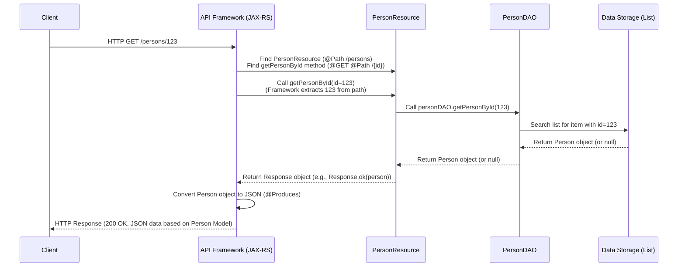

This flow is very similar to what we saw in previous chapters, but this time it's specifically working with the `Person` model.

Let's look at the relevant code snippets from `src/main/java/com/example/resource/PersonResource.java` and `src/main/java/com/example/dao/PersonDAO.java`.

First, in `PersonResource.java`, we have the method handling the `GET /persons/{id}` request:

```java
// Inside PersonResource.java

@GET // Handles GET requests
@Path("/{id}") // Adds the dynamic ID part to the path
public Response getPersonById(@PathParam("id") int id) {
    // @PathParam extracts the ID from the URL and passes it here

    logger.info("Retrieving Person with ID {}", id); // Log the action

    Person person = personDAO.getPersonById(id); // Ask the DAO for the Person

    if (person != null) {
        // If found, return 200 OK with the person data (JSON)
        return Response.ok(person).build();
    } else {
        // If not found, return 404 Not Found
        return Response.status(Response.Status.NOT_FOUND).entity("Person Not Found").build();
    }
}
```

This method receives the `id` from the URL, calls a method on the `personDAO` to fetch the data, and then returns a response based on whether a `Person` object was found.

Now, let's look at the `getPersonById` method in `src/main/java/com/example/dao/PersonDAO.java`:

```java
// Inside PersonDAO.java

private List<Person> personList =  new ArrayList<>(); // Our simple in-memory storage

// Read operation - Get person by ID
public Person getPersonById(int id) {
    // Loop through our list of Persons
    for (Person person : personList) {
        // Check if the current person's ID matches the requested ID
        if (person.getId() == id) {
            return person; // Found it! Return the Person object.
        }
    }
    // If the loop finishes without finding a match, return null
    return null;
}
```

The `PersonDAO`'s job is to handle the data storage logic. In this simple example, it just searches through a list of `Person` objects held in memory. When it finds a `Person` object whose `id` matches, it returns that `Person` object.

So, when you make a `GET /persons/123` request, the `PersonResource` asks the `PersonDAO` to find the `Person` with ID 123. The `PersonDAO` searches its list and returns the `Person` object. The `PersonResource` then wraps this `Person` object in a successful `Response`, and the API framework converts the `Person` object's data (name, address, contact, id) into JSON to send back to the client.

### Summary

The `Person` class serves as a foundational [Data Model (Entity)](02_data_models__entities__.md) in our `Health_System_API`. By containing attributes common to all individuals, like `name`, `address`, `contact`, and `id`, it allows more specific models like `Patient` and `Doctor` to inherit these properties using the `extends` keyword. This promotes code reuse and makes the system easier to manage. While primarily a base class, it can also be managed directly through its own resource endpoint (`/persons`) and corresponding [Data Access Object (DAO)](10_data_access_objects__daos__.md) to demonstrate the handling of generic person data.

Now that we understand the basic `Person` foundation, we can dive into the more specific models that extend it, starting with `Patient`.

[Next Chapter: Patient](04_patient_.md)

---

<sub><sup>Generated by [AI Codebase Knowledge Builder](https://github.com/The-Pocket/Tutorial-Codebase-Knowledge).</sup></sub> <sub><sup>**References**: [[1]](https://github.com/Sehandu-Siriwardhana/Health_System_API/blob/9702cb3b830e63aa140ddd0c21adac901ed05067/src/main/java/com/example/dao/PersonDAO.java), [[2]](https://github.com/Sehandu-Siriwardhana/Health_System_API/blob/9702cb3b830e63aa140ddd0c21adac901ed05067/src/main/java/com/example/model/Person.java), [[3]](https://github.com/Sehandu-Siriwardhana/Health_System_API/blob/9702cb3b830e63aa140ddd0c21adac901ed05067/src/main/java/com/example/resource/PersonResource.java)</sup></sub>

# Chapter 4: Patient

Welcome back to the Health System API tutorial! In our previous chapters, we explored the structure of our API with [Chapter 1: API Resources (Endpoints)](01_api_resources__endpoints__.md), the blueprints for our data called [Chapter 2: Data Models (Entities)](02_data_models__entities__.md), and the foundational [Chapter 3: Person](03_person_.md) class that holds common information like name and address.

Now, we're ready to look at one of the most important data models in a health system: the **Patient**.

### What is a Patient in Our System?

In a real-world health system, a patient is a person who receives medical care. They aren't just a name and address; they have a health history, current conditions, allergies, and other specific medical details.

In our `Health_System_API`, we need a way to represent this information. This is the role of the `Patient` class.

Just like we discussed in [Chapter 3: Person](03_person_.md), a Patient *is* a Person. They have a name, address, contact, and ID. But they also have unique characteristics related to their health.

The `Patient` class is our specific **blueprint** for representing someone receiving healthcare services. It builds upon the basic `Person` blueprint and adds the extra details needed for patient care.

Think of it like this:
*   The `Person` blueprint gives us the frame, wheels, and engine for a basic vehicle.
*   The `Patient` blueprint takes that basic vehicle and adds specific features like a special medical scanner, a comfortable recovery bed, and storage for medical records. It's still a vehicle, but specialized for carrying patients.

### The Patient Blueprint (`Patient.java`)

The `Patient` class is a [Data Model (Entity)](02_data_models__entities__.md). You can find its blueprint in `src/main/java/com/example/model/Patient.java`.

Let's look at the key parts of the `Patient` class:

```java
package com.example.model;

/**
 * Represents a Patient, a specific type of Person with health-related attributes.
 */
public class Patient extends Person { // <-- Patient IS A Person!
    // Attributes specific to Patient
    private String medicalHistory;
    private String currentHealthStatus;
    // int id is inherited from Person, but declared again here in the original code.
    // In a real system, you might only declare ID in the base class
    // and use super.getId() / super.setId(), but we'll match the provided code.
    private int id; // Unique identifier for the patient

    // Default constructor (useful when receiving data from API)
    public Patient() {
       // Inherits default constructor from Person implicitly or explicitly
    }

    // Parameterized constructor
    public Patient(String name, String address, String contact, // These come from Person
                   String medicalHistory, String currentHealthStatus, int id) {
        super(name, address, contact);  // Call Person's constructor to set basic details
        this.medicalHistory = medicalHistory; // Set patient-specific details
        this.currentHealthStatus = currentHealthStatus;
        this.id = id; // Set the patient's unique ID
    }

    // --- Getters and Setters ---
    // Getter for id
    public int getId() {
        return id;
    }

    // Setter for id
    public void setId(int id) {
        this.id = id;
    }

    // Getter for medicalHistory
    public String getMedicalHistory() {
        return medicalHistory;
    }

    // Setter for medicalHistory
    public void setMedicalHistory(String medicalHistory) {
        this.medicalHistory = medicalHistory;
    }

    // Getter for currentHealthStatus
    public String getCurrentHealthStatus() {
        return currentHealthStatus;
    }

    // Setter for currentHealthStatus
    public void setCurrentHealthStatus(String currentHealthStatus) {
        this.currentHealthStatus = currentHealthStatus;
    }

    // Getters and setters for name, address, contact are also available
    // because Patient extends Person!
    // For example: getName(), setName(), getAddress(), setAddress(), etc.
}
```

*   `public class Patient extends Person`: This is the key line showing **inheritance**. It means `Patient` inherits all the public and protected properties and methods from the `Person` class.
*   `private String medicalHistory;`: This is an attribute *specific* to a `Patient`. It stores information about their past health issues.
*   `private String currentHealthStatus;`: Another patient-specific attribute, describing their health right now.
*   Constructors: The constructors (`Patient()`, `Patient(...)`) are used to create new `Patient` objects. The parameterized constructor uses `super(name, address, contact)` to call the parent `Person` class's constructor and set the basic information.
*   Getters and Setters: Methods like `getMedicalHistory()` and `setMedicalHistory()` allow other parts of the code or the API framework to read and write these specific patient details. Getters and setters for `name`, `address`, `contact`, and `id` from the `Person` class are automatically available to `Patient` objects as well.

This class defines the structure of the data we store and exchange for patients.

### How to Interact with Patient Data (Use Case)

A common task for an API client (like a mobile app) is to retrieve the details of a specific patient. Our API provides an endpoint for this: `GET /patients/{id}`.

Let's say a mobile app wants to show the details for the patient with ID `123`.

**Client Request (Example):**

```
GET /patients/123
Host: your-api-url.com
```

**Expected API Response (Example JSON):**

If a patient with ID 123 exists, the API should respond with a status code of `200 OK` and send back a JSON object representing that patient's data, structured according to the `Patient` model:

```json
{
  "id": 123,
  "name": "Alice Smith",
  "address": "123 Main St",
  "contact": "alice.s@example.com",
  "medicalHistory": "Has allergies to penicillin",
  "currentHealthStatus": "Stable"
}
```

Notice how the response includes both the generic `Person` details (`id`, `name`, `address`, `contact`) and the specific `Patient` details (`medicalHistory`, `currentHealthStatus`).

### How it Works Under the Hood (`GET /patients/{id}`)

When a client sends a `GET /patients/{id}` request, here's a simplified step-by-step look at what happens inside our API:

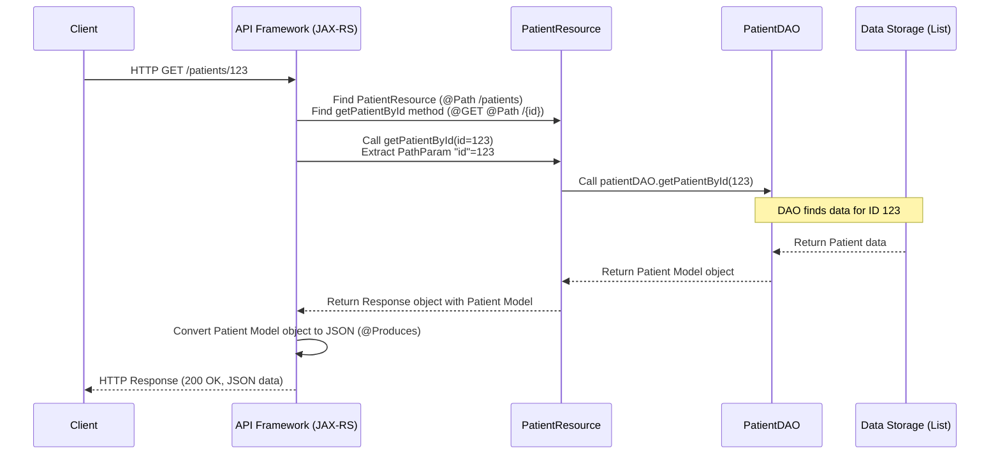

Let's look at the relevant code pieces that make this happen.

First, in `src/main/java/com/example/resource/PatientResource.java`, we have the API Resource method that handles the `GET` request for a specific patient ID:

```java
// Inside PatientResource.java

// This annotation sets the base path for methods in this class
@Path("/patients")
// ... other annotations and class declaration ...

// GET method to retrieve a patient by ID
@GET // This method handles GET requests
@Path("/{id}") // This adds a dynamic path segment (e.g., /patients/123)
public Response getPatientById(@PathParam("id") int id) {
    // @PathParam tells JAX-RS to get the 'id' value from the URL path
    // and pass it into this method as the 'id' parameter.

    // We use a PatientDAO object to get the actual data.
    Patient patient = patientDAO.getPatientById(id); // Call the DAO method

    if (patient != null) {
        // If the DAO found a patient, return it with a 200 OK status.
        // The framework will automatically convert the 'patient' (Patient model object)
        // into JSON because of the @Produces annotation on the class.
        return Response.ok(patient).build();
    } else {
        // If the DAO returned null (patient not found), return 404 Not Found.
        return Response.status(Response.Status.NOT_FOUND).entity("Patient Not Found").build();
    }
    // ... error handling omitted for simplicity ...
}
```

This method receives the `id` from the URL, asks the `PatientDAO` for the patient data, and then creates an appropriate `Response` based on whether the patient was found.

Next, let's peek into the `src/main/java/com/example/dao/PatientDAO.java` file, specifically the `getPatientById` method:

```java
// Inside PatientDAO.java

// This list acts as our simple in-memory storage for patients for this tutorial
private static List<Patient> patientList = new ArrayList<>();

// Read operation - Get patient by ID
public Patient getPatientById(int id) {
    // Loop through every Patient object currently in our list
    for (Patient patient : patientList) {
        // Check if the ID of the current patient matches the requested ID
        if (patient.getId() == id) {
            // Found the patient! Return the Patient object.
            return patient;
        }
    }
    // If the loop finishes without finding a patient with the given ID, return null.
    return null;
}
// ... other DAO methods for adding, updating, deleting patients ...
```

The `PatientDAO` is responsible for interacting with the data storage (which is a simple list in memory for this tutorial). The `getPatientById` method iterates through the list of `Patient` objects, checking each one's ID. If it finds a match, it returns the corresponding `Patient` object. If it goes through the whole list without finding a match, it returns `null`.

So, when the `PatientResource` calls `patientDAO.getPatientById(123)`, the DAO searches its list. If it finds a `Patient` object with ID 123, it returns that object. The `PatientResource` then gets this `Patient` object, puts it into a `Response`, and the API framework converts it to JSON for the client.

### Other Patient Operations

Besides retrieving a patient by ID (`GET /patients/{id}`), the `PatientResource` class also provides endpoints to manage patients:

*   `GET /patients`: Retrieve a list of *all* patients.
*   `POST /patients`: Add a new patient. The client sends the new patient's details in the request body (as JSON), which the API framework converts into a `Patient` object to pass to the resource method.
*   `PUT /patients/{id}`: Update an existing patient. The client specifies the ID in the URL and sends the updated details (as JSON) in the request body. The API framework provides the ID and the updated `Patient` object to the resource method.
*   `DELETE /patients/{id}`: Delete a patient by ID.

All these operations work with the `Patient` [Data Model (Entity)](02_data_models__entities__.md) – either receiving a `Patient` object from the client (`POST`, `PUT`) or returning one (or a list of them) to the client (`GET`).

### Summary

The `Patient` class is a core [Data Model (Entity)](02_data_models__entities__.md) in our `Health_System_API` that represents a person receiving healthcare. It extends the basic [Chapter 3: Person](03_person_.md) class to inherit common attributes like name and address, and adds specific attributes like `medicalHistory` and `currentHealthStatus`.

The `/patients` [Chapter 1: API Resources (Endpoints)](01_api_resources__endpoints__.md) endpoint, handled by the `PatientResource` class, allows clients to interact with patient data using standard HTTP methods (`GET`, `POST`, `PUT`, `DELETE`). These resource methods work closely with the `Patient` model, receiving `Patient` objects (from incoming JSON) or returning `Patient` objects (to be converted into outgoing JSON), and they rely on the [Chapter 10: Data Access Objects (DAOs)](10_data_access_objects__daos__.md), specifically `PatientDAO`, to handle the actual data storage and retrieval.

Now that we understand the Patient, let's look at another key player in the health system: the Doctor.

[Next Chapter: Doctor](05_doctor_.md)

---

<sub><sup>Generated by [AI Codebase Knowledge Builder](https://github.com/The-Pocket/Tutorial-Codebase-Knowledge).</sup></sub> <sub><sup>**References**: [[1]](https://github.com/Sehandu-Siriwardhana/Health_System_API/blob/9702cb3b830e63aa140ddd0c21adac901ed05067/src/main/java/com/example/dao/PatientDAO.java), [[2]](https://github.com/Sehandu-Siriwardhana/Health_System_API/blob/9702cb3b830e63aa140ddd0c21adac901ed05067/src/main/java/com/example/model/Appointment.java), [[3]](https://github.com/Sehandu-Siriwardhana/Health_System_API/blob/9702cb3b830e63aa140ddd0c21adac901ed05067/src/main/java/com/example/model/Billing.java), [[4]](https://github.com/Sehandu-Siriwardhana/Health_System_API/blob/9702cb3b830e63aa140ddd0c21adac901ed05067/src/main/java/com/example/model/MedicalRecord.java), [[5]](https://github.com/Sehandu-Siriwardhana/Health_System_API/blob/9702cb3b830e63aa140ddd0c21adac901ed05067/src/main/java/com/example/model/Patient.java), [[6]](https://github.com/Sehandu-Siriwardhana/Health_System_API/blob/9702cb3b830e63aa140ddd0c21adac901ed05067/src/main/java/com/example/resource/PatientResource.java)</sup></sub>

# Chapter 5: Doctor

Welcome back! In the last chapter, [Chapter 4: Patient](04_patient_.md), we learned about the `Patient` data model, which represents individuals receiving care in our system. We saw how it builds upon the basic [Chapter 3: Person](03_person_.md) class.

Now, we're going to look at another key player in the healthcare system: the **Doctor**. Just like patients are people, doctors are also people, but with a specialized role.

### What is a Doctor in Our System?

In a health system, a doctor is a healthcare professional who provides medical services. They diagnose illnesses, prescribe treatments, and perform procedures. Beyond their basic identity (like name and address), doctors have specific qualifications and areas of expertise.

In our `Health_System_API`, the `Doctor` class is our **blueprint** for representing these professionals. It needs to store the basic information that all people have, *plus* the details specific to a doctor, most importantly, their **specialization**.

Just as `Patient` extends `Person`, the `Doctor` class also extends `Person`. This is a perfect example of how [Chapter 3: Person](03_person_.md) helps us reuse code. The `Doctor` gets the `name`, `address`, `contact`, and `id` fields automatically from `Person`, and then adds its own specific attributes.

Think of it using our vehicle analogy:
*   The `Person` blueprint is the basic vehicle frame.
*   The `Patient` blueprint adds medical features for carrying patients.
*   The `Doctor` blueprint adds different specialized equipment, like diagnostic tools and prescription pads, turning the basic vehicle into a medical professional's transport. It's still a vehicle (a Person), but specialized for a doctor's work.

### The Doctor Blueprint (`Doctor.java`)

The `Doctor` class is another important [Data Model (Entity)](02_data_models__entities__.md). You can find its blueprint in `src/main/java/com/example/model/Doctor.java`.

Let's look at the code that defines the `Doctor` model:

```java
package com.example.model;

/**
 * Represents a Doctor, a specialized type of Person.
 */
public class Doctor extends Person { // <-- Doctor IS A Person!
    private String specialization; // Attribute specific to Doctor
    // int id, String name, String address, String contact
    // are inherited from Person

    // Default constructor
    public Doctor() {
        // Inherits default constructor from Person implicitly or explicitly
    }

    // Parameterized constructor
    public Doctor(String name, String address, String contact, // From Person
                  String specialization, int id) { // Doctor specific + ID
        super(name, address, contact);  // Call Person's constructor for basic info
        this.specialization = specialization; // Set doctor-specific detail
        this.setId(id); // Set the ID using the setter inherited from Person
                        // Note: Original code also declared 'id' again here,
                        // which is less standard inheritance but matches the source.
                        // We'll use super.setId() for clarity but note the original structure.
    }

    // --- Getters and Setters ---

    // Getter for specialization
    public String getSpecialization() {
        return specialization;
    }

    // Setter for specialization
    public void setSpecialization(String specialization) {
        this.specialization = specialization;
    }

    // Getters and setters for name, address, contact, and id
    // are available because Doctor extends Person!
    // For example: getName(), setName(), getId(), setId(), etc.
    // (Although the original code declares id again and uses its own getters/setters)
}
```

*   `public class Doctor extends Person`: This indicates that `Doctor` inherits from `Person`. It gets the properties and behavior of a `Person` automatically.
*   `private String specialization;`: This is the key attribute *specific* to a `Doctor`. It stores information like "Cardiology", "Pediatrics", "Neurology", etc.
*   Constructors: The constructors help create `Doctor` objects. The parameterized one uses `super(name, address, contact)` to initialize the `Person` part of the `Doctor` object. The `id` is set separately, often by calling the inherited `setId()` method (or its own `setId()` if declared again, as in the provided code).
*   Getters and Setters: `getSpecialization()` and `setSpecialization()` provide access to the doctor's specialization. All the getters and setters from `Person` (like `getName()`, `setAddress()`, `getId()`, etc.) are also available for a `Doctor` object.

This class defines the structure for all doctor data in our system.

### How to Interact with Doctor Data (Use Case)

A common task would be for a client (like an appointment booking system) to look up a doctor's details, perhaps to display their specialization or contact information. Our API provides an endpoint for this: `GET /doctors/{id}`.

Let's say a client wants to find the details for the doctor with ID `456`.

**Client Request (Example):**

```
GET /doctors/456
Host: your-api-url.com
```

**Expected API Response (Example JSON):**

If a doctor with ID 456 exists, the API should respond with a status code of `200 OK` and send back a JSON object representing that doctor's data, structured according to the `Doctor` model:

```json
{
  "id": 456,
  "name": "Dr. Jane Doe",
  "address": "456 Oak Ave",
  "contact": "jane.d@example.com",
  "specialization": "Pediatrics"
}
```

Notice how this JSON includes both the generic `Person` details (`id`, `name`, `address`, `contact`) and the specific `Doctor` detail (`specialization`).

### How it Works Under the Hood (`GET /doctors/{id}`)

When a client sends a `GET /doctors/{id}` request (like `GET /doctors/456`), here's a simplified step-by-step look at what happens inside our API:

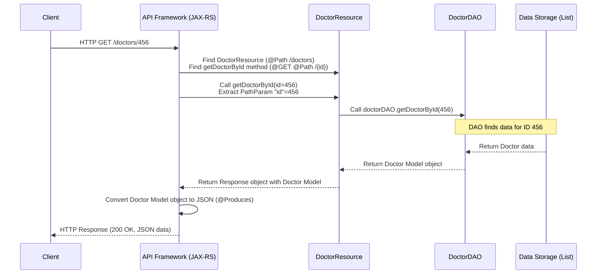

This flow is very similar to the `GET /patients/{id}` request we saw in the previous chapter, but it involves the `DoctorResource`, `DoctorDAO`, and the `Doctor` data model instead of the patient-specific ones.

Let's look at the code pieces involved in handling this request.

First, in `src/main/java/com/example/resource/DoctorResource.java`, we have the method that handles the `GET` request for a specific doctor ID:

```java
// Inside DoctorResource.java

@Path("/doctors") // Base path for all doctor endpoints
// ... other annotations and class declaration ...

// GET method to retrieve a doctor by ID
@GET // Handles GET requests
@Path("/{id}") // Adds the dynamic ID part to the path (e.g., /doctors/456)
public Response getDoctorById(@PathParam("id") int id) {
    // @PathParam gets the 'id' value from the URL and passes it here.
    logger.info("Retrieving Doctor with ID {}", id); // Log for debugging

    // Use a DoctorDAO object to fetch the doctor data.
    Doctor doctor = doctorDAO.getDoctorById(id); // Call the DAO method

    if (doctor != null) {
        // If found, return 200 OK with the doctor data (JSON).
        // The framework converts the 'doctor' object to JSON thanks to @Produces.
        return Response.ok(doctor).build();
    } else {
        // If not found, return 404 Not Found.
        return Response.status(Response.Status.NOT_FOUND).entity("Doctor Not Found").build();
    }
    // ... error handling omitted for simplicity ...
}
```

This method takes the ID from the URL, asks the `DoctorDAO` to find the doctor with that ID, and returns either the `Doctor` object (wrapped in a `200 OK` response) or a `404 Not Found` response.

Next, let's see the `getDoctorById` method in `src/main/java/com/example/dao/DoctorDAO.java`:

```java
// Inside DoctorDAO.java

// Our simple in-memory storage for doctors
private static List<Doctor> doctorList = new ArrayList<>();

// Read operation - Get doctor by ID
public Doctor getDoctorById(int id) {
    // Loop through every Doctor object in our list
    for (Doctor doctor : doctorList) {
        // Check if the current doctor's ID matches the requested ID
        if (doctor.getId() == id) {
            // Found the doctor! Return the Doctor object.
            return doctor;
        }
    }
    // If the loop finishes without finding a match, return null.
    return null;
}
// ... other DAO methods for adding, updating, deleting doctors ...
```

This `DoctorDAO` method is responsible for data access. In our simplified tutorial project, it just searches through a list of `Doctor` objects stored in memory. It returns the `Doctor` object if found, or `null` if not.

So, when the `DoctorResource` calls `doctorDAO.getDoctorById(456)`, the DAO searches its list. If a `Doctor` object with ID 456 is found, it returns that object. The `DoctorResource` receives this `Doctor` object, puts it into a successful `Response`, and the API framework automatically converts it into JSON to send back to the client, including all its properties (inherited from `Person` and its own `specialization`).

### Other Doctor Operations

Just like with patients, the `DoctorResource` class provides other endpoints for managing doctor data:

*   `GET /doctors`: Retrieve a list of *all* doctors.
*   `POST /doctors`: Add a new doctor. The client sends doctor details (as JSON), converted into a `Doctor` object for the resource method.
*   `PUT /doctors/{id}`: Update an existing doctor by ID. The client provides the ID and updated details (as JSON).
*   `DELETE /doctors/{id}`: Delete a doctor by ID.

All these endpoints interact with the `Doctor` [Data Model (Entity)](02_data_models__entities__.md) and rely on the [Chapter 10: Data Access Objects (DAOs)](10_data_access_objects__daos__.md) to handle the data.

### Summary

The `Doctor` class is a crucial [Data Model (Entity)](02_data_models__entities__.md) in our `Health_System_API`. It represents healthcare professionals by extending the basic [Chapter 3: Person](03_person_.md) class to inherit common attributes and adding its own specific attribute: `specialization`.

The `/doctors` [Chapter 1: API Resources (Endpoints)](01_api_resources__endpoints__.md) endpoint, managed by the `DoctorResource` class, allows clients to perform common operations like retrieving, adding, updating, and deleting doctor data. These resource methods work directly with `Doctor` objects and delegate the actual data handling to the `DoctorDAO`.

Now that we've covered both the `Patient` and `Doctor` models, we can explore how they interact in the system, starting with appointments.

[Next Chapter: Appointment](06_appointment_.md)

---

<sub><sup>Generated by [AI Codebase Knowledge Builder](https://github.com/The-Pocket/Tutorial-Codebase-Knowledge).</sup></sub> <sub><sup>**References**: [[1]](https://github.com/Sehandu-Siriwardhana/Health_System_API/blob/9702cb3b830e63aa140ddd0c21adac901ed05067/src/main/java/com/example/dao/DoctorDAO.java), [[2]](https://github.com/Sehandu-Siriwardhana/Health_System_API/blob/9702cb3b830e63aa140ddd0c21adac901ed05067/src/main/java/com/example/model/Appointment.java), [[3]](https://github.com/Sehandu-Siriwardhana/Health_System_API/blob/9702cb3b830e63aa140ddd0c21adac901ed05067/src/main/java/com/example/model/Doctor.java), [[4]](https://github.com/Sehandu-Siriwardhana/Health_System_API/blob/9702cb3b830e63aa140ddd0c21adac901ed05067/src/main/java/com/example/resource/DoctorResource.java)</sup></sub>

# Chapter 6: Appointment

Welcome back to the Health System API tutorial! In our recent chapters, we've learned about the main characters in our system: the [Chapter 4: Patient](04_patient_.md), representing someone receiving care, and the [Chapter 5: Doctor](05_doctor_.md), representing the healthcare professional. Both of these models build upon the basic [Chapter 3: Person](03_person_.md) class.

Now, how do we connect a specific patient with a specific doctor at a particular time for a consultation? This is where the **Appointment** concept comes in.

### What is an Appointment?

In a health system, an appointment is simply a scheduled meeting. It brings together:

1.  A specific **Patient**
2.  A specific **Doctor**
3.  A specific **Date** and **Time**

Think of it like an entry in a shared calendar. It notes who (the patient) is meeting whom (the doctor) and exactly when.

In our `Health_System_API`, the `Appointment` class serves as the **blueprint** for this scheduled meeting information. It's a [Data Model (Entity)](02_data_models__entities__.md) that ties a `Patient` object and a `Doctor` object together with time-based details.

It doesn't *contain* all the patient's history or the doctor's specialization itself, but it holds **references** to the specific `Patient` and `Doctor` objects involved in that particular meeting.

Imagine you have separate files for each patient and each doctor. An appointment record is like a small note that says: "Meeting: See Patient File #123, See Doctor File #456, on Date YYYY-MM-DD, at Time HH:MM". The appointment record itself doesn't duplicate the full files; it just points to them.

### The Appointment Blueprint (`Appointment.java`)

The `Appointment` class defines the structure of data for a scheduled appointment. You can find its blueprint in `src/main/java/com/example/model/Appointment.java`.

Let's look at the code for the `Appointment` model:

```java
package com.example.model;

// Needed for date/time handling, although we are using Strings in this model
// import java.time.LocalDateTime;

public class Appointment {
    // Attributes for Appointment

    private int id; // Unique ID for this appointment
    private String date; // The date of the appointment (using String for simplicity)
    private String time; // The time of the appointment (using String for simplicity)
    private Patient patient; // A reference to the Patient object involved
    private Doctor doctor;   // A reference to the Doctor object involved

    // Default constructor (needed by frameworks to create objects from JSON)
    public Appointment() {
    }

    // Parameterized constructor to create a new Appointment object
    public Appointment(int id, String date, String time, Patient patient, Doctor doctor) {
        this.id = id;
        this.date = date;
        this.time = time;
        this.patient = patient;
        this.doctor = doctor;
    }

    // --- Getters and Setters ---

    // Getter for the unique appointment ID
    public int getId() {
        return id;
    }

    // Setter for the unique appointment ID
    public void setId(int id) {
        this.id = id;
    }

    // Getter for the appointment date
    public String getDate() {
        return date;
    }

    // Setter for the appointment date
    public void setDate(String date) {
        this.date = date;
    }

    // Getter for the appointment time
    public String getTime() {
        return time;
    }

    // Setter for the appointment time
    public void setTime(String time) {
        this.time = time;
    }

    // Getter for the Patient object involved in this appointment
    public Patient getPatient() {
        return patient;
    }

    // Setter for the Patient object involved in this appointment
    public void setPatient(Patient patient) {
        this.patient = patient;
    }

    // Getter for the Doctor object involved in this appointment
    public Doctor getDoctor() {
        return doctor;
    }

    // Setter for the Doctor object involved in this appointment
    public void setDoctor(Doctor doctor) {
        this.doctor = doctor;
    }
}
```

Key points about the `Appointment` model:

*   It has basic fields like `id`, `date`, and `time` to define *when* the appointment is.
*   Crucially, it has fields `patient` and `doctor`. These are not just simple text strings; their types are `Patient` and `Doctor`. This means an `Appointment` object holds *references* to a `Patient` object and a `Doctor` object. This is how it links them together.
*   It has standard constructors and getter/setter methods for all its attributes, allowing other parts of the code and the API framework to interact with its data.

This class serves as the blueprint for creating, storing, and exchanging appointment information.

### How to Create an Appointment (Use Case)

A core function of a health system API is allowing appointments to be scheduled. Let's walk through how a client (like an admin panel or patient portal) would add a new appointment using our API.

The API endpoint for creating new data is typically a `POST` request to the collection's base path. For appointments, this is `POST /appointments`.

To create an appointment, the client needs to send the details of the new appointment to the API. Since our API expects and produces JSON ([Chapter 1: API Resources (Endpoints)](01_api_resources__endpoints__.md)), the client will send the data in JSON format, structured according to the `Appointment` model.

**Client Request (Example):**

Let's say we want to book an appointment for the patient with ID 123 and the doctor with ID 456 on October 27, 2023, at 10:00 AM.

```
POST /appointments
Host: your-api-url.com
Content-Type: application/json

{
  "id": 1,         // A unique ID for this appointment (often generated by the system)
  "date": "2023-10-27",
  "time": "10:00",
  "patient": {     // Include the full Patient object details (or just ID if DAO handles lookup)
    "id": 123,
    "name": "Alice Smith", // Or include other patient details as needed/expected by API
    "address": "...",
    "contact": "...",
    "medicalHistory": "...",
    "currentHealthStatus": "..."
  },
  "doctor": {      // Include the full Doctor object details (or just ID)
    "id": 456,
    "name": "Dr. Jane Doe", // Or include other doctor details
    "address": "...",
    "contact": "...",
    "specialization": "..."
  }
}
```

*Note: In a real API, it might be more efficient for the client to only send the patient ID and doctor ID, and the API's internal logic (likely in the DAO) would fetch the full `Patient` and `Doctor` objects. However, the provided code expects the full `Patient` and `Doctor` objects within the `Appointment` JSON.*

**Expected API Response (Example):**

If the appointment is successfully created, the API should respond with a status code indicating success, typically `201 Created`, and maybe a confirmation message.

```
HTTP/1.1 201 Created
Content-Type: text/plain // Or application/json
Location: /appointments/1 // Optional: URL of the newly created resource

Appointment Created Successfully
```

### How it Works Under the Hood (`POST /appointments`)

When a client sends this `POST /appointments` request with the JSON data, here's a simplified look at what happens inside our API:

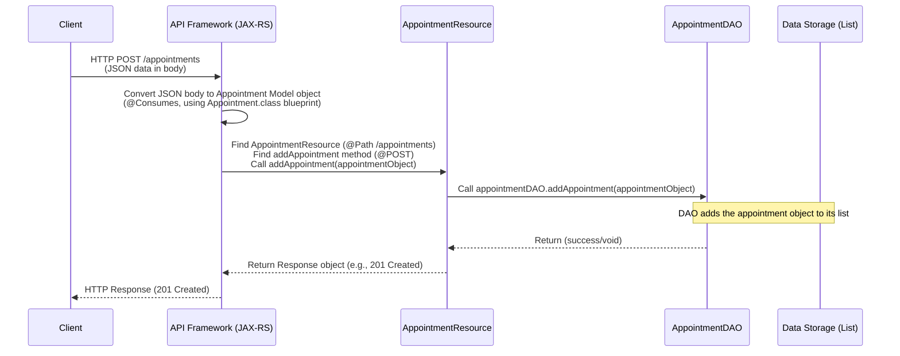

Let's dive into the code snippets that make this work.

First, in `src/main/java/com/example/resource/AppointmentResource.java`, we have the method that handles the `POST` request:

```java
// Inside AppointmentResource.java

@Path("/appointments") // Base path for all appointment endpoints
@Consumes(MediaType.APPLICATION_JSON) // Expects incoming data to be JSON
// ... other annotations and class declaration ...

// POST method to add a new appointment
@POST // Handles POST requests
public Response addAppointment(Appointment appointment) {
    // JAX-RS framework automatically converts the incoming JSON
    // request body into an 'Appointment' object based on the
    // Appointment model blueprint and passes it as the argument.

    logger.info("Adding New Appointment: {}", appointment); // Log the action

    // Use an AppointmentDAO object to save the data.
    appointmentDAO.addAppointment(appointment); // Call the DAO method

    // Return a success response (201 Created).
    return Response.status(Response.Status.CREATED).entity("Appointment Created Successfully").build();
    // ... error handling omitted for simplicity ...
}
```

This method is quite simple thanks to the API framework. The framework automatically takes the incoming JSON and creates a Java `Appointment` object from it (including creating and populating the nested `Patient` and `Doctor` objects based on the JSON structure). The resource method then receives this ready-to-use `Appointment` object and simply passes it to the `AppointmentDAO` to be stored.

Next, let's look at the `addAppointment` method in `src/main/java/com/example/dao/AppointmentDAO.java`:

```java
// Inside AppointmentDAO.java

// Our simple in-memory storage for appointments
private static List<Appointment> appointmentList =  new ArrayList<>();

// Create operation - Add a new appointment
public void addAppointment(Appointment appointment) {
    try {
        // Add the received Appointment object to our list.
        // In a real system, this would insert into a database.
        appointmentList.add(appointment);
        logger.info("Appointment added successfully: {}", appointment);
    } catch (Exception e) {
        logger.error("Failed to add appointment: {}", e.getMessage());
        // In a real system, proper exception handling would be here.
    }
}

// ... other DAO methods ...
```

The `AppointmentDAO`'s job is to handle the data storage. In this simple tutorial version, the `addAppointment` method just takes the `Appointment` object it received from the `AppointmentResource` and adds it to a static `ArrayList` (our in-memory database).

So, the flow is: Client sends JSON -> API framework converts JSON to `Appointment` object -> Resource receives `Appointment` object -> Resource passes `Appointment` object to DAO -> DAO adds `Appointment` object to storage.

### Other Appointment Operations

Besides adding appointments (`POST /appointments`), the `AppointmentResource` also provides other common endpoints for managing appointments, all of which work with the `Appointment` data model:

*   `GET /appointments`: Retrieve a list of *all* appointments.
*   `GET /appointments/{id}`: Retrieve the details of a specific appointment by its unique ID.
*   `PUT /appointments/{id}`: Update an existing appointment by its ID. The client sends the updated appointment details (as JSON), which are converted into an `Appointment` object to be used by the resource and DAO.
*   `DELETE /appointments/{id}`: Delete an appointment by its ID.

All these operations rely on the `Appointment` [Data Model (Entity)](02_data_models__entities__.md) and use the `AppointmentDAO` to perform the actual data access (retrieving from or removing from our list).

### Summary

The `Appointment` class is a vital [Data Model (Entity)](02_data_models__entities__.md) in our `Health_System_API` that represents a scheduled meeting between a [Chapter 4: Patient](04_patient_.md) and a [Chapter 5: Doctor](05_doctor_.md) at a specific date and time. It achieves this by holding references to `Patient` and `Doctor` objects within its own structure, along with the date and time information.

The `/appointments` [Chapter 1: API Resources (Endpoints)](01_api_resources__endpoints__.md) endpoint, managed by the `AppointmentResource` class, allows clients to perform actions like creating, retrieving, updating, and deleting appointments using standard HTTP methods. These resource methods work directly with `Appointment` objects (received from or sent to the client as JSON) and delegate the data storage logic to the `AppointmentDAO`.

Now that we've connected Patients and Doctors via Appointments, let's look at how we track a patient's health history with Medical Records.

[Next Chapter: Medical Record](07_medical_record_.md)

---

<sub><sup>Generated by [AI Codebase Knowledge Builder](https://github.com/The-Pocket/Tutorial-Codebase-Knowledge).</sup></sub> <sub><sup>**References**: [[1]](https://github.com/Sehandu-Siriwardhana/Health_System_API/blob/9702cb3b830e63aa140ddd0c21adac901ed05067/src/main/java/com/example/dao/AppointmentDAO.java), [[2]](https://github.com/Sehandu-Siriwardhana/Health_System_API/blob/9702cb3b830e63aa140ddd0c21adac901ed05067/src/main/java/com/example/model/Appointment.java), [[3]](https://github.com/Sehandu-Siriwardhana/Health_System_API/blob/9702cb3b830e63aa140ddd0c21adac901ed05067/src/main/java/com/example/resource/AppointmentResource.java)</sup></sub>

# Chapter 7: Medical Record

Welcome back to our tutorial on the `Health_System_API`! In the last few chapters, we've introduced the main players in our system: the [Chapter 4: Patient](04_patient_.md) (the person receiving care) and the [Chapter 5: Doctor](05_doctor_.md) (the professional providing care). We also learned how to connect them for a scheduled visit using the [Chapter 6: Appointment](06_appointment_.md) model.

But what happens *during* and *after* those visits? How do we keep track of a patient's health journey over time? Their past illnesses, their current treatments, observations made by doctors? This is where the concept of a **Medical Record** comes in.

### What is a Medical Record?

Think about visiting a doctor's office. The doctor often keeps a file or a digital record for you. This record contains everything important about your health history:

*   Any health problems you've been diagnosed with.
*   Any treatments or procedures you've received.
*   Notes from different doctors about your condition, visits, and progress.

This collection of information is your **Medical Record**. It's a dynamic document that grows over time, accumulating all significant medical information for a specific person.

In our `Health_System_API`, the `MedicalRecord` class is the **blueprint** for storing this kind of detailed health history for a patient. It's like a digital version of that physical file or journal, dedicated to one patient.

### The Medical Record Blueprint (`MedicalRecord.java`)

The `MedicalRecord` class is another essential [Data Model (Entity)](02_data_models__entities__.md) in our system. It defines the structure for holding a patient's health history details. You can find its blueprint in `src/main/java/com/example/model/MedicalRecord.java`.

Let's look at the key parts of the `MedicalRecord` class:

```java
package com.example.model;

import java.util.ArrayList;
import java.util.List; // Needed for lists

public class MedicalRecord {

    private int id; // Unique ID for this specific medical record
    private Patient patient;  // Reference to the patient this record belongs to
    private List<String> diagnoses;  // List of diagnoses (e.g., "Flu", "Hypertension")
    private List<String> treatments;  // List of treatments (e.g., "Antibiotics", "Physical Therapy")
    private List<String> notes;  // Additional medical notes (e.g., "Patient reports feeling better", "Follow-up needed")

    // Default constructor
    public MedicalRecord (){
        // Initialize lists so we can add to them later
        this.diagnoses = new ArrayList<>();
        this.treatments = new ArrayList<>();
        this.notes = new ArrayList<>();
    }

    // Parameterized constructor
    public MedicalRecord(Patient patient, int id) {
        this.patient = patient;
        this.id = id;
        // Initialize lists
        this.diagnoses = new ArrayList<>();
        this.treatments = new ArrayList<>();
        this.notes = new ArrayList<>();
    }

    // --- Getters and Setters ---

    // Get the unique ID of THIS medical record
    public int getId() { return id; }
    // Set the unique ID of THIS medical record
    public void setId(int id) { this.id = id; }

    // Get the Patient object associated with this record
    public Patient getPatient() { return patient; }
    // Set the Patient object associated with this record
    public void setPatient(Patient patient) { this.patient = patient; }

    // Get the list of diagnoses
    public List<String> getDiagnoses() { return diagnoses; }
    // Method to add a diagnosis to the list
    public void addDiagnosis(String diagnosis) { diagnoses.add(diagnosis); }

    // Get the list of treatments
    public List<String> getTreatments() { return treatments; }
    // Method to add a treatment to the list
    public void addTreatment(String treatment) { treatments.add(treatment); }

    // Get the list of notes
    public List<String> getNotes() { return notes; }
    // Method to add a note to the list
    public void addNote(String note) { notes.add(note); }

    // Note: There are no setters for the lists themselves (getDiagnoses, etc.)
    // You modify the lists by adding items using addDiagnosis, addTreatment, addNote.
}
```

Key features of the `MedicalRecord` model:

*   **`id`**: A unique identifier for *this specific medical record*. A patient might have multiple medical records over time, though in this simple version, maybe just one primary one.
*   **`patient`**: This is a **reference** to a `Patient` object. It links this medical record to the specific patient it belongs to. Just like the `Appointment` model referenced `Patient` and `Doctor`, the `MedicalRecord` references the `Patient`.
*   **`diagnoses`, `treatments`, `notes`**: These are `List<String>`. A `List` is a collection that can hold multiple items of the same type (here, `String` text). This allows a single medical record to store many diagnoses, many treatments, and many notes added over time.
*   **Add Methods**: The `addDiagnosis()`, `addTreatment()`, and `addNote()` methods are convenient ways to add new information to the lists.
*   **Getters/Setters**: Standard methods for accessing and modifying the attributes.

This class provides the structure for bundling together a patient's health history information.

### How to Interact with Medical Records (Use Case)

A common action related to medical records is retrieving the record for a specific patient or just getting a specific record if you know its ID. Our API provides endpoints for this, such as `GET /medical-records/{id}`.

Let's say a doctor wants to view the medical record with ID `789`.

**Client Request (Example):**

```
GET /medical-records/789
Host: your-api-url.com
```

**Expected API Response (Example JSON):**

If a medical record with ID 789 exists, the API should respond with a status code of `200 OK` and send back a JSON object representing that record's data, structured according to the `MedicalRecord` model:

```json
{
  "id": 789,
  "patient": { // The API includes the linked Patient object details
    "id": 123,
    "name": "Alice Smith",
    "address": "...",
    "contact": "...",
    "medicalHistory": "...", // Note: This is from the Patient model itself
    "currentHealthStatus": "..."
  },
  "diagnoses": [
    "Common Cold (2023-10-15)",
    "Influenza (2022-12-01)"
  ],
  "treatments": [
    "Rest and fluids (2023-10-15)",
    "Tamiflu prescription (2022-12-01)"
  ],
  "notes": [
    "Patient presented with fever and cough (2023-10-15)",
    "Symptoms improving on follow-up (2023-10-20)"
  ]
}
```

Notice how the JSON response includes the record's ID, the linked patient's details, and the lists of diagnoses, treatments, and notes.

### How it Works Under the Hood (`GET /medical-records/{id}`)

When a client sends a `GET /medical-records/{id}` request (like `GET /medical-records/789`), here's a simplified look at what happens inside our API:

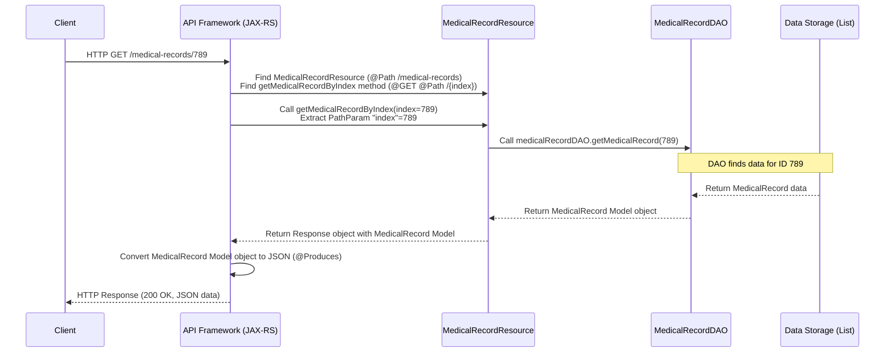

This flow should look familiar by now! It follows the standard pattern: Client request -> API Framework maps to Resource method -> Resource method calls DAO -> DAO interacts with Data Storage -> DAO returns Model object -> Resource returns Response with Model -> API Framework converts Model to JSON -> Response sent back to Client.

Let's look at the specific code pieces for retrieving a medical record by its ID.

First, in `src/main/java/com/example/resource/MedicalRecordResource.java`, we have the method handling the `GET` request:

```java
// Inside MedicalRecordResource.java

@Path("/medical-records") // Base path for medical record endpoints
@Produces(MediaType.APPLICATION_JSON) // Usually sends back JSON
// ... other annotations and class declaration ...

// GET method to retrieve a medical record by index (ID)
@GET // Handles GET requests
@Path("/{index}") // Dynamic path segment for the record ID
public Response getMedicalRecordByIndex(@PathParam("index") int index) {
    // @PathParam gets the 'index' (which we use as ID) from the URL

    logger.info("Retrieving Medical Record at ID {}", index); // Log for tracking

    // Use the MedicalRecordDAO to fetch the record
    MedicalRecord medicalRecord = medicalRecordDAO.getMedicalRecord(index);

    if (medicalRecord != null) {
        // If found, return 200 OK with the medical record data (JSON)
        return Response.ok(medicalRecord).build();
    } else {
        // If not found, return 404 Not Found
        return Response.status(Response.Status.NOT_FOUND).entity("Medical Record Not Found").build();
    }
    // ... error handling omitted for simplicity ...
}
```

This method receives the ID from the URL, asks the `MedicalRecordDAO` for the record, and returns a response based on the result.

Next, let's look at the `getMedicalRecord` method in `src/main/java/com/example/dao/MedicalRecordDAO.java`:

```java
// Inside MedicalRecordDAO.java

// Our simple in-memory storage for medical records
private static List<MedicalRecord> medicalRecordList =  new ArrayList<>();

// Read operation - Get medical record by ID (using 'index' in method name)
public MedicalRecord getMedicalRecord(int id) { // Renamed parameter to 'id' for clarity
    // Loop through our list of Medical Records
    for (MedicalRecord medicalRecord : medicalRecordList ) {
        // Check if the current record's ID matches the requested ID
        if ( medicalRecord .getId() == id) {
            return  medicalRecord ; // Found it! Return the object.
        }
    }
    // If the loop finishes without finding a match, return null
    return null;
}
// ... other DAO methods for adding, updating, deleting records ...
```

The `MedicalRecordDAO` is responsible for data access. Its `getMedicalRecord` method iterates through the `medicalRecordList` (our simple storage) and returns the `MedicalRecord` object if its ID matches the requested `id`, otherwise it returns `null`.

When `MedicalRecordResource` calls `medicalRecordDAO.getMedicalRecord(789)`, the DAO searches its list. If it finds a `MedicalRecord` object with ID 789, it returns that object. The `MedicalRecordResource` receives this `MedicalRecord` object, wraps it in a `Response`, and the API framework converts the object's data (including the nested Patient data and the lists) into JSON for the client.

### Other Medical Record Operations

The `MedicalRecordResource` class, like others we've seen, provides additional endpoints for managing medical records:

*   `GET /medical-records`: Retrieve a list of *all* medical records in the system.
*   `POST /medical-records`: Add a new medical record. The client sends the new record's details in the request body (as JSON). The API framework converts this JSON into a `MedicalRecord` object, which is then passed to the resource method and the DAO for storage.
*   `PUT /medical-records/{id}`: Update an existing medical record by ID. The client provides the ID in the URL and the updated record details (as JSON) in the request body.
*   `DELETE /medical-records/{id}`: Delete a medical record by ID.

All these operations rely on the `MedicalRecord` [Data Model (Entity)](02_data_models__entities__.md) and the `MedicalRecordDAO` to handle the data.

### Summary

The `MedicalRecord` class is a key [Data Model (Entity)](02_data_models__entities__.md) in our `Health_System_API` for representing a patient's health history. It includes a reference to the [Chapter 4: Patient](04_patient_.md) it belongs to and uses lists (`List<String>`) to store collections of `diagnoses`, `treatments`, and `notes` that are added over time.

The `/medical-records` [Chapter 1: API Resources (Endpoints)](01_api_resources__endpoints__.md) endpoint, managed by the `MedicalRecordResource` class, allows clients to interact with this health history data using standard HTTP methods. These resource methods work directly with `MedicalRecord` objects (received from or sent to the client as JSON) and use the `MedicalRecordDAO` to handle the data storage and retrieval logic.

Now that we've covered patient history, let's move on to another important aspect of the health system: managing finances and charges.

[Next Chapter: Billing](08_billing_.md)

---

<sub><sup>Generated by [AI Codebase Knowledge Builder](https://github.com/The-Pocket/Tutorial-Codebase-Knowledge).</sup></sub> <sub><sup>**References**: [[1]](https://github.com/Sehandu-Siriwardhana/Health_System_API/blob/9702cb3b830e63aa140ddd0c21adac901ed05067/src/main/java/com/example/dao/MedicalRecordDAO.java), [[2]](https://github.com/Sehandu-Siriwardhana/Health_System_API/blob/9702cb3b830e63aa140ddd0c21adac901ed05067/src/main/java/com/example/model/MedicalRecord.java), [[3]](https://github.com/Sehandu-Siriwardhana/Health_System_API/blob/9702cb3b830e63aa140ddd0c21adac901ed05067/src/main/java/com/example/resource/MedicalRecordResource.java)</sup></sub>

# Chapter 8: Billing

Welcome back to the Health System API tutorial! So far, we've focused on the core medical aspects: identifying people ([Chapter 3: Person](03_person_.md)), specifically patients ([Chapter 4: Patient](04_patient_.md)) and doctors ([Chapter 5: Doctor](05_doctor_.md)), scheduling their interactions ([Chapter 6: Appointment](06_appointment_.md)), and keeping track of health history ([Chapter 7: Medical Record](07_medical_record_.md)).

But a health system, like any organization, also needs to manage its finances. How do we track the charges for the services provided to a patient and the payments made? This is the role of the **Billing** system.

### What is Billing in Our System?

Think of the `Billing` concept in our API as the patient's financial account statement or ledger. Every time a patient receives a service (like a consultation, a procedure, or medication), there's usually a charge associated with it. Payments are also made towards these charges.

The `Billing` class is designed to keep a record of all these financial transactions for a specific patient. It doesn't track *all* the patient's health details (that's the [Medical Record](07_medical_record_.md)'s job), but it specifically focuses on the money side of things.

The main component within a `Billing` record is a collection of **`Invoice`** objects. Each `Invoice` represents a single charge (like the cost of one appointment or one lab test) and potentially any payments made towards that specific charge.

So, a `Billing` object for a patient is essentially:
*   A link to the specific **Patient** it belongs to.
*   A **List** of individual **`Invoice`** records.

Imagine a physical folder labeled with the patient's name, but instead of medical notes, it contains a stack of bills and payment receipts. This is conceptually what the `Billing` object represents.

### The Billing Blueprint (`Billing.java`)

The `Billing` class is a [Data Model (Entity)](02_data_models__entities__.md) that structures the financial information for a patient. You can find its blueprint in `src/main/java/com/example/model/Billing.java`.

Let's look at the key parts of the `Billing` class:

```java
package com.example.model;

import java.util.ArrayList;
import java.util.List; // Needed for lists

public class Billing {

    private int id; // Unique ID for this billing record
    private Patient patient;  // Reference to the patient
    private List<Invoice> invoices;  // List of invoices (charges/payments)

    // Default constructor (useful when receiving data from API)
    public Billing() {
        // Initialize the list so we can add invoices
        this.invoices = new ArrayList<>();
    }

    // Parameterized constructor
    public Billing(Patient patient, int id) {
        this.patient = patient;
        this.id = id;
        // Initialize the list
        this.invoices = new ArrayList<>();
    }

    // --- Getters and Setters ---

    // Get the unique ID of THIS billing record
    public int getId() { return id; }
    // Set the unique ID of THIS billing record
    public void setId(int id) { this.id = id; }

    // Get the Patient object associated with this record
    public Patient getPatient() { return patient; }
    // Set the Patient object associated with this record
    public void setPatient(Patient patient) { this.patient = patient; }

    // Get the list of invoices
    public List<Invoice> getInvoices() { return invoices; }

    // Method to add an invoice to the list
    public void addInvoice(Invoice invoice) {
        invoices.add(invoice);
    }

    // Method to calculate total outstanding balance from all invoices
    public double getTotalOutstandingBalance() {
        // Go through each invoice, get its outstanding amount, and add them up
        return invoices.stream()
                .mapToDouble(Invoice::getOutstandingAmount)
                .sum();
    }

    // ... toString method omitted for brevity ...

    // Nested class to handle Invoice details - defined right inside Billing.java
    public static class Invoice {
        private double amount;    // The total charge for this invoice item
        private double paidAmount; // The amount paid towards this specific charge

        // Constructor for Invoice
        public Invoice(double amount, double paidAmount) {
            this.amount = amount;
            this.paidAmount = paidAmount;
        }

        // Getters and setters for amount and paidAmount
        public double getAmount() { return amount; }
        public void setAmount(double amount) { this.amount = amount; }
        public double getPaidAmount() { return paidAmount; }
        public void setPaidAmount(double paidAmount) { this.paidAmount = paidAmount; }

        // Calculate outstanding amount for THIS invoice
        public double getOutstandingAmount() {
            return amount - paidAmount;
        }
        // ... other methods/details for Invoice ...
    }
}
```

Key features of the `Billing` model:

*   **`id`**: A unique identifier for *this billing record* (which belongs to one patient).
*   **`patient`**: A **reference** to the specific [Chapter 4: Patient](04_patient_.md) object this billing record is for.
*   **`invoices`**: A `List<Invoice>`. This is where all the individual charge and payment records for this patient are stored.
*   **`Invoice` nested class**: Notice that the definition for `Invoice` is right *inside* the `Billing` class. This is a "nested class" and it makes sense here because an `Invoice` is primarily meaningful in the context of a patient's `Billing`. Each `Invoice` has an `amount` (the charge) and a `paidAmount`. The `getOutstandingAmount()` method calculates how much is still owed for *that specific invoice*.
*   **`getTotalOutstandingBalance()`**: This method in the `Billing` class is useful! It goes through *all* the `Invoice` objects in the `invoices` list and adds up their individual outstanding amounts to give you the total amount the patient owes.
*   **Constructors and Getters/Setters**: Standard ways to create `Billing` objects and access their data.

This class structure gives us a way to represent and manage the financial state for each patient.

### How to Interact with Billing Data (Use Case)

A common task is to record a new charge or a payment for a patient. This involves adding a new entry (or updating an existing one) in their billing record. Let's imagine adding an initial billing record for a patient, which might include a first charge (invoice) for a consultation.

The API endpoint for creating new data is typically `POST` to the collection's base path. For billing, this is `POST /billing`.

The client needs to send the details of the new billing entry, including the patient information and the initial invoice details, in JSON format.

**Client Request (Example):**

Let's say patient ID 123 just had a consultation that costs $100, and they haven't paid yet. We want to create their initial billing record with this first invoice.

```
POST /billing
Host: your-api-url.com
Content-Type: application/json

{
  "id": 1,        // Unique ID for this billing record (system might generate)
  "patient": {    // Include patient details (or just ID, depending on API logic)
    "id": 123,
    "name": "Alice Smith", // Include other patient details if needed/expected
    "...": "..."
  },
  "invoices": [   // This is a list of invoices
    {
      "amount": 100.00, // The charge for the consultation
      "paidAmount": 0.00 // Nothing paid yet
    }
  ]
}
```

*Note: As with Appointments, in a real API, the client might only send the patient ID, and the backend would fetch the full Patient object and generate the billing ID. But based on the provided code structure, sending the full Patient object (or enough details for the API to recreate it) and the billing ID might be expected.*

**Expected API Response (Example):**

If the billing record is successfully created, the API should respond with a status code `201 Created` and perhaps a success message.

```
HTTP/1.1 201 Created
Content-Type: text/plain // Or application/json

Billing Created Successfully
```

### How it Works Under the Hood (`POST /billing`)

When a client sends this `POST /billing` request with the JSON data, here's a simplified look at what happens inside our API:

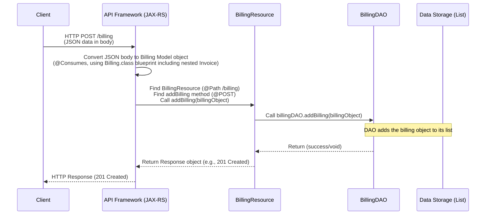

This process mirrors the flow we've seen for other resources like [Patient](04_patient_.md) and [Appointment](06_appointment_.md). The API framework takes the incoming JSON, uses the `Billing` model (including the `Invoice` part) as a blueprint to create a Java object, passes it to the resource method, which then passes it to the DAO for storage.

Let's look at the code snippets.

First, in `src/main/java/com/example/resource/BillingResource.java`, we have the method handling the `POST` request:

```java
// Inside BillingResource.java

@Path("/billing") // Base path for all billing endpoints
@Consumes(MediaType.APPLICATION_JSON) // Expects incoming data to be JSON
// ... other annotations and class declaration ...

// POST method to add a new billing record
@POST // Handles POST requests
public Response addBilling(Billing billing) {
    // JAX-RS framework automatically converts the incoming JSON
    // request body into a 'Billing' object (including its nested
    // Patient and Invoice objects) based on the Billing model blueprint.

    logger.info("Adding New Billing: {}", billing); // Log the action

    // Use a BillingDAO object to save the data.
    billingDAO.addBilling(billing); // Call the DAO method

    // Return a success response (201 Created).
    return Response.status(Response.Status.CREATED).entity("Billing Created Successfully").build();
    // ... error handling omitted for simplicity ...
}
```

This method is straightforward. The API framework does the heavy lifting of converting the JSON into a `Billing` object. The `BillingResource` method then just passes this object to the `billingDAO`.

Next, let's look at the `addBilling` method in `src/main/java/com/example/dao/BillingDAO.java`:

```java
// Inside BillingDAO.java

// Our simple in-memory storage for billing records
private static List<Billing> billingList =  new ArrayList<>();

// Create operation - Add a new billing record
public void addBilling(Billing billing) {
    try {
        // Add the received Billing object to our list.
        // In a real system, this would insert into a database table.
        billingList.add(billing);
        logger.info("Billing added successfully for patient: {}", billing.getPatient().getName());
    } catch (Exception e) {
        logger.error("Failed to add billing: {}", e.getMessage());
        // In a real system, proper exception handling would be here.
    }
}

// ... other DAO methods ...
```

The `BillingDAO` handles the data storage for `Billing` objects. The `addBilling` method takes the `Billing` object passed from the resource and adds it to the static `billingList` (our simple in-memory data store).

### Other Billing Operations

The `BillingResource` also provides other endpoints for managing billing records, all interacting with the `Billing` data model and using the `BillingDAO`:

*   `GET /billing`: Retrieve a list of *all* billing records in the system.
*   `GET /billing/{id}`: Retrieve the details of a specific billing record by its unique ID. This would return the `Billing` object, including all its linked patient details and the list of invoices.
*   `PUT /billing/{id}`: Update an existing billing record by its ID. This could be used to add new invoices (charges or payments) to a patient's existing billing record. The client sends the updated `Billing` object (with the new invoice added to the list), which is converted to a `Billing` object and passed to the DAO.
*   `DELETE /billing/{id}`: Delete a billing record by its ID.

All these operations rely on the `Billing` [Data Model (Entity)](02_data_models__entities__.md) and the `BillingDAO` to handle the data access (reading from, writing to, or removing from our list).

### Summary

The `Billing` class is an essential [Data Model (Entity)](02_data_models__entities__.md) in our `Health_System_API` that manages the financial aspects of a patient's care. It serves as a ledger, linking to the [Chapter 4: Patient](04_patient_.md) and containing a `List` of `Invoice` objects. The nested `Invoice` class represents individual charges and payments, allowing the `Billing` object to track outstanding balances using the `getTotalOutstandingBalance()` method.

The `/billing` [Chapter 1: API Resources (Endpoints)](01_api_resources__endpoints__.md) endpoint, handled by the `BillingResource` class, provides the interface for clients to interact with billing data. These resource methods work directly with `Billing` objects (receiving them from or sending them to clients as JSON) and delegate the actual storage logic to the `BillingDAO`.

Now that we've covered the financial tracking, let's move on to another crucial medical concept: managing patient prescriptions.

[Next Chapter: Prescription](09_prescription_.md)

---

<sub><sup>Generated by [AI Codebase Knowledge Builder](https://github.com/The-Pocket/Tutorial-Codebase-Knowledge).</sup></sub> <sub><sup>**References**: [[1]](https://github.com/Sehandu-Siriwardhana/Health_System_API/blob/9702cb3b830e63aa140ddd0c21adac901ed05067/src/main/java/com/example/dao/BillingDAO.java), [[2]](https://github.com/Sehandu-Siriwardhana/Health_System_API/blob/9702cb3b830e63aa140ddd0c21adac901ed05067/src/main/java/com/example/model/Billing.java), [[3]](https://github.com/Sehandu-Siriwardhana/Health_System_API/blob/9702cb3b830e63aa140ddd0c21adac901ed05067/src/main/java/com/example/resource/BillingResource.java)</sup></sub>

# Chapter 9: Prescription

Welcome back to our Health System API tutorial! In the last chapter, [Chapter 8: Billing](08_billing_.md), we explored how our API handles the financial side of patient care using the `Billing` model and its nested `Invoice` concept.

Now, let's move on to another crucial element in patient treatment: **Prescriptions**.

### What is a Prescription?

When you visit a doctor and they decide you need medication, they write a prescription. This isn't just a random note; it's a specific instruction detailing:

*   What medication you need.
*   How much you should take (the dosage).
*   How you should take it (the instructions, like "take with food" or "apply twice daily").
*   For how long you should take it (the duration).

In essence, a prescription is the doctor's order for a specific course of medication for a patient.

In our `Health_System_API`, we need a way to record and manage these instructions electronically. This is the role of the **`Prescription`** class. It's our **blueprint** for storing all the essential details of a doctor's medication order.

Think of it like a digital sticky note attached to a patient's record, specifically for medication details. It doesn't contain the patient's whole history, but it has the precise information needed for a pharmacy or the patient themselves to understand and follow the medication plan.

### The Prescription Blueprint (`Prescription.java`)

The `Prescription` class is a [Data Model (Entity)](02_data_models__entities__.md) that defines the structure for storing prescription details. You can find its blueprint in `src/main/java/com/example/model/Prescription.java`.

Let's look at the core attributes of the `Prescription` class:

```java
package com.example.model;

public class Prescription {
    // Attributes for the Prescription
    private String medicationName;
    private String dosage;
    private String instructions;
    private int durationDays; // How many days to take the medication
    private int id;           // Unique ID for this prescription

    // Default constructor (Needed by frameworks, e.g., for JSON conversion)
    public  Prescription (){}

    // Parameterized constructor (To create a Prescription object with values)
    public Prescription(String medicationName, String dosage, String instructions, int durationDays, int id) {
        this.medicationName = medicationName;
        this.dosage = dosage;
        this.instructions = instructions;
        this.durationDays = durationDays;
        this.id = id;
    }

    // --- Getters and Setters ---
    // (Methods to access and modify attributes)

    public int getId() { return id; }
    public void setId(int id) { this.id = id; }

    public String getMedicationName() { return medicationName; }
    public void setMedicationName(String medicationName) { this.medicationName = medicationName; }

    // ... getters and setters for dosage, instructions, durationDays ...
}
```

As you can see:

*   It's a simple class with fields to hold the core pieces of information found on a prescription: `medicationName`, `dosage`, `instructions`, and `durationDays`.
*   It also has a unique `id` to identify this specific prescription record.
*   It includes a default constructor and a parameterized constructor to create `Prescription` objects.
*   Standard getter and setter methods are provided for each attribute, allowing other parts of the application or the API framework to read and write the data.

Unlike `Appointment` or `MedicalRecord`, this specific `Prescription` model *doesn't* explicitly contain a reference back to the `Patient` or `Doctor` in the provided code. In a more complex system, it likely would. However, for this tutorial's simple model, it just focuses on the medication *details themselves*. The association to a patient or an appointment might be handled in other ways or assumed in the context (e.g., if prescriptions are always added *to* a patient's medical record). Based *only* on the provided `Prescription.java`, it's a standalone model describing *a* prescription.

This class provides the structure for the digital representation of a medication prescription.

### How to Interact with Prescription Data (Use Case)

A common task involving prescriptions would be to add a new prescription after a doctor's visit or to retrieve the details of an existing prescription. Let's focus on how a client (like a doctor's interface) would add a new prescription using our API.

The API endpoint for creating new data is typically a `POST` request to the collection's base path. For prescriptions, this is `POST /prescriptions`.

To add a prescription, the client needs to send the details of the medication instruction to the API, formatted as JSON according to the `Prescription` model.

**Client Request (Example):**

Let's say a doctor is prescribing "Amoxicillin" for a patient.

```
POST /prescriptions
Host: your-api-url.com
Content-Type: application/json

{
  "id": 101,              // Unique ID for this prescription (system might generate)
  "medicationName": "Amoxicillin",
  "dosage": "500mg",
  "instructions": "Take one capsule every 8 hours with food",
  "durationDays": 7
}
```

*Note: The inclusion of the `id` in the client request depends on whether the API expects the client to provide it or if the system generates it. In this project's DAO, the ID seems to be expected from the client.*

**Expected API Response (Example):**

If the prescription is successfully added, the API should respond with a status code indicating success, typically `201 Created`, and maybe a confirmation message.

```
HTTP/1.1 201 Created
Content-Type: text/plain // Or application/json

Prescription Created Successfully
```

### How it Works Under the Hood (`POST /prescriptions`)

When a client sends this `POST /prescriptions` request with the JSON data, here's a simplified look at what happens inside our API, following the pattern we've seen:

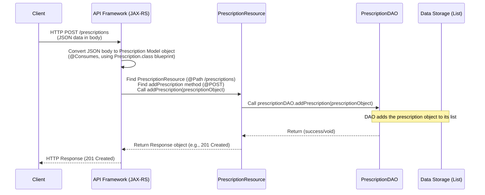

This flow is now quite familiar! The client sends JSON, the API framework (`JAX-RS`) converts it into a Java `Prescription` object using the model's blueprint, passes the object to the `PrescriptionResource` method, which then calls the `PrescriptionDAO` to handle storing the object.

Let's look at the relevant code snippets.

First, in `src/main/java/com/example/resource/PrescriptionResource.java`, we find the method that handles `POST` requests:

```java
// Inside PrescriptionResource.java

@Path("/prescriptions") // Base path for prescriptions
@Consumes(MediaType.APPLICATION_JSON) // Expects incoming data to be JSON
// ... other annotations and class declaration ...

// POST method to add a new prescription
@POST // Handles POST requests
public Response addPrescription(Prescription prescription) {
    // JAX-RS framework automatically converts the incoming JSON
    // request body into a 'Prescription' object based on the
    // Prescription model blueprint and passes it as the argument.

    logger.info("Adding New Prescription: {}", prescription); // Log action

    // Use a PrescriptionDAO object to save the data.
    prescriptionDAO.addPrescription(prescription); // Call DAO method

    // Return a success response (201 Created).
    return Response.status(Response.Status.CREATED).entity("Prescription Created Successfully").build();
    // ... error handling omitted for simplicity ...
}
```

Just like with other resources, this method is simple because the framework handles the JSON-to-Java conversion. It receives a ready-to-use `Prescription` object and delegates the storage task to the `prescriptionDAO`.

Next, let's look at the `addPrescription` method in `src/main/java/com/example/dao/PrescriptionDAO.java`:

```java
// Inside PrescriptionDAO.java

// Our simple in-memory storage for prescriptions
private static List<Prescription> prescriptionList =  new ArrayList<>();

// Create operation - Add a new prescription
public void addPrescription(Prescription prescription) {
    // For this tutorial, we just add the object to our list.
    // In a real application, this would be database insertion logic.
    prescriptionList.add(prescription);
    logger.info("Prescription added successfully: {}", prescription.getMedicationName());
}

// ... other DAO methods ...
```

The `PrescriptionDAO` handles the data storage for `Prescription` objects. The `addPrescription` method simply takes the `Prescription` object received from the resource and adds it to the static `prescriptionList` (our simple in-memory storage).

### Other Prescription Operations

The `PrescriptionResource` class, like others, provides additional endpoints for managing prescriptions:

*   `GET /prescriptions`: Retrieve a list of *all* prescriptions in the system.
*   `GET /prescriptions/{id}`: Retrieve the details of a specific prescription by its unique ID. The DAO method for this is named `getPrescription` and takes an `index` parameter which is used as the ID.
*   `PUT /prescriptions/{id}`: Update an existing prescription by its ID. The client provides the ID in the URL and the updated prescription details (as JSON) in the request body.
*   `DELETE /prescriptions/{id}`: Delete a prescription by its ID.

All these operations rely on the `Prescription` [Data Model (Entity)](02_data_models__entities__.md) and the `PrescriptionDAO` to handle the data access (reading from, writing to, or removing from our list).

### Summary

The `Prescription` class is a [Data Model (Entity)](02_data_models__entities__.md) in our `Health_System_API` that represents a doctor's specific instruction for medication, detailing the `medicationName`, `dosage`, `instructions`, and `durationDays`. It serves as a simple blueprint for storing this crucial information.

The `/prescriptions` [Chapter 1: API Resources (Endpoints)](01_api_resources__endpoints__.md) endpoint, handled by the `PrescriptionResource` class, provides the interface for clients to interact with prescription data using standard HTTP methods. These resource methods work directly with `Prescription` objects (receiving them from or sending them to clients as JSON) and delegate the actual storage logic to the `PrescriptionDAO`.

We've now seen how different parts of our system (Patients, Doctors, Appointments, Records, Billing, Prescriptions) are represented by dedicated Data Models. In the next chapter, we'll focus on the component we've mentioned repeatedly – the **Data Access Objects (DAOs)** – and understand their vital role in handling the interaction with data storage.

[Next Chapter: Data Access Objects (DAOs)](10_data_access_objects__daos__.md)

---

<sub><sup>Generated by [AI Codebase Knowledge Builder](https://github.com/The-Pocket/Tutorial-Codebase-Knowledge).</sup></sub> <sub><sup>**References**: [[1]](https://github.com/Sehandu-Siriwardhana/Health_System_API/blob/9702cb3b830e63aa140ddd0c21adac901ed05067/src/main/java/com/example/dao/PrescriptionDAO.java), [[2]](https://github.com/Sehandu-Siriwardhana/Health_System_API/blob/9702cb3b830e63aa140ddd0c21adac901ed05067/src/main/java/com/example/model/Prescription.java), [[3]](https://github.com/Sehandu-Siriwardhana/Health_System_API/blob/9702cb3b830e63aa140ddd0c21adac901ed05067/src/main/java/com/example/resource/PrescriptionResource.java)</sup></sub>

# Chapter 10: Data Access Objects (DAOs)

Welcome back to the Health System API tutorial! We've now explored several core parts of our application:
*   [Chapter 1: API Resources (Endpoints)](01_api_resources__endpoints__.md) – the entry points where clients interact with our API.
*   [Chapter 2: Data Models (Entities)](02_data_models__entities__.md) (and specific models like [Chapter 4: Patient](04_patient_.md), [Chapter 5: Doctor](05_doctor_.md), etc.) – the blueprints that define the structure of our data.

We've seen how a [Resource](01_api_resources__endpoints__.md) like `PatientResource` handles a request like `GET /patients/{id}` and needs to get data about a specific patient. But where does `PatientResource` actually *get* that patient data from? How does it save new patient data when a client sends a `POST` request?

This is where **Data Access Objects**, or **DAOs**, come in.

### What are Data Access Objects (DAOs)?

Think of our data storage (like our lists of patients, doctors, etc.) as a library. The [API Resources](01_api_resources__endpoints__.md) are like the front desk of the library where visitors (clients) make requests: "Can I see Patient #123?" or "Please add this new Appointment."

The **DAOs** are like the **librarians**.

*   They know exactly where the books (the data) are kept.
*   They know *how* to retrieve a specific book by its ID.
*   They know *how* to put a new book onto the shelves.
*   They know *how* to update the information about a book.
*   They know *how* to remove a book.

The important thing is that the front desk (the [Resource](01_api_resources__endpoints__.md)) doesn't need to know *how* the librarian (the DAO) does their job – they just need to know *which* librarian to ask and *what* task to request (like "find book by ID").

The primary job of a DAO is to provide a **clean way** for the rest of your application (like the [Resource Classes](01_api_resources__endpoints__.md)) to interact with your data storage **without knowing the technical details of how the data is stored**.

In our simple tutorial project, the data storage is just basic Java `ArrayList` objects in memory. But in a real application, it would be a database (like MySQL, PostgreSQL, MongoDB) or perhaps files on disk. If we decided to switch from using `ArrayList`s to using a database later, we would *only* need to change the code inside the DAO classes. The [Resource Classes](01_api_resources__endpoints__.md) that use the DAOs wouldn't need to be changed at all! This separation makes our code much easier to manage and update.

### Where to Find DAOs

In the `Health_System_API` project, you'll find the DAO classes in the `src/main/java/com/example/dao` folder.

Look inside, and you'll see files like:

*   `PatientDAO.java`
*   `DoctorDAO.java`
*   `AppointmentDAO.java`
*   `MedicalRecordDAO.java`
*   `BillingDAO.java`
*   `PrescriptionDAO.java`
*   `PersonDAO.java`

Each of these classes is the dedicated "librarian" for a specific type of data ([Data Model](02_data_models__entities__.md)).

### Anatomy of a Simple DAO (Example: PatientDAO)

Let's look at the `PatientDAO.java` file to understand its structure.

```java
package com.example.dao;

import com.example.model.Patient; // Needs to know about the Patient model
import java.util.ArrayList;
import java.util.List; // Needs List and ArrayList for storage

public class PatientDAO {

    // --- Our simple in-memory "database" ---
    // This list holds all the Patient objects.
    // 'static' means this list is shared by all instances of PatientDAO.
    private static List<Patient> patientList = new ArrayList<>();

    // --- DAO Methods (The Librarian's tasks) ---

    // 1. Create Operation: Adding a new patient
    public void addPatient(Patient patient) {
        // In this simple example, we just add the patient object to the list.
        // In a real app, this would be database INSERT logic.
        patientList.add(patient);
    }

    // 2. Read Operation: Getting all patients
    public List<Patient> getAllPatients() {
        // Return the entire list of patients.
        // In a real app, this would be database SELECT * FROM patients logic.
        return patientList;
    }

    // 3. Read Operation: Getting a patient by their ID
    public Patient getPatientById(int id) {
        // Loop through the list to find the patient with the matching ID.
        // In a real app, this would be database SELECT ... WHERE id = ...
        for (Patient patient : patientList) {
            if (patient.getId() == id) {
                return patient; // Found the patient!
            }
        }
        // If the loop finishes, the patient wasn't found.
        return null;
    }

    // 4. Update Operation: Modifying an existing patient
    public void updatePatient(int id, Patient updatedPatient) {
        // Find the patient by ID and replace it with the updated version.
        // In a real app, this would be database UPDATE logic.
        for (int i = 0; i < patientList.size(); i++) {
            if (patientList.get(i).getId() == id) {
                patientList.set(i, updatedPatient); // Replace the old object
                return; // Stop searching once updated
            }
        }
        // (In a real app, you might handle "not found" here)
    }

    // 5. Delete Operation: Removing a patient
    public void deletePatient(int id) {
        // Find the patient by ID and remove it.
        // In a real app, this would be database DELETE logic.
        for (int i = 0; i < patientList.size(); i++) {
            if (patientList.get(i).getId() == id) {
                patientList.remove(i); // Remove from the list
                return; // Stop searching once deleted
            }
        }
        // (In a real app, you might handle "not found" here)
    }
}
```

As you can see, a DAO class is quite simple in this project:

*   It holds a reference to the data storage (the `static List<Patient> patientList`).
*   It provides methods for the fundamental data operations: adding (`addPatient`), getting (`getAllPatients`, `getPatientById`), updating (`updatePatient`), and deleting (`deletePatient`). These are often called **CRUD** operations (Create, Read, Update, Delete).
*   The code inside these methods directly interacts with the data storage mechanism (the `ArrayList` methods like `add`, iterating with `for`, `set`, and `remove`).

### How DAOs Work with Resources (Revisiting a Use Case)

Let's revisit the `GET /patients/{id}` use case we discussed in [Chapter 4: Patient](04_patient_.md). We saw how the `PatientResource` handles this request. Now we know it uses the `PatientDAO`.

Here's the relevant part of the `PatientResource` again:

```java
// Inside PatientResource.java

// ... (class annotations and other methods) ...

private PatientDAO patientDAO = new PatientDAO(); // The Resource needs a DAO instance

// GET method to retrieve a patient by ID
@GET
@Path("/{id}")
public Response getPatientById(@PathParam("id") int id) {

    // *** This is where the Resource uses the DAO! ***
    // It calls the DAO's method to get the data.
    // It doesn't care IF the DAO reads from a list or a database.
    Patient patient = patientDAO.getPatientById(id); // Ask the DAO for the Patient

    if (patient != null) {
        // If the DAO found a patient, return it in the response.
        return Response.ok(patient).build();
    } else {
        // If the DAO returned null (not found), return 404.
        return Response.status(Response.Status.NOT_FOUND).entity("Patient Not Found").build();
    }
}
```

When the `getPatientById` method in `PatientResource` is called, it simply delegates the task of finding the patient to `patientDAO.getPatientById(id)`. The `PatientResource` doesn't contain any code for looping through lists or querying a database; it trusts the `PatientDAO` to do that work and return the `Patient` object.

### The Data Flow with DAOs

Let's use our sequence diagram again to visualize how the DAO fits into the overall flow when a client requests data:

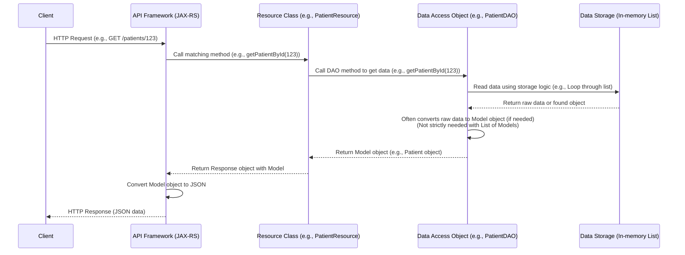

As you can see, the DAO acts as a bridge. The [Resource](01_api_resources__endpoints__.md) talks *only* to the DAO, and the DAO talks *only* to the [Data Storage](!nofilename). This keeps the layers separate and independent.

### CRUD Methods Across DAOs

You will find similar CRUD methods in all the DAO classes in the `com.example.dao` package:

| Data Model          | Corresponding DAO       | Common Methods                                     |
| :------------------ | :---------------------- | :------------------------------------------------- |
| [Person](03_person_.md)          | `PersonDAO`             | `addPerson`, `getAllPersons`, `getPersonById`, `updatePerson`, `deletePerson` |
| [Patient](04_patient_.md)        | `PatientDAO`            | `addPatient`, `getAllPatients`, `getPatientById`, `updatePatient`, `deletePatient` |
| [Doctor](05_doctor_.md)         | `DoctorDAO`             | `addDoctor`, `getAllDoctors`, `getDoctorById`, `updateDoctor`, `deleteDoctor` |
| [Appointment](06_appointment_.md)| `AppointmentDAO`        | `addAppointment`, `getAllAppointments`, `getAppointment`, `updateAppointment`, `deleteAppointment` |
| [Medical Record](07_medical_record_.md)| `MedicalRecordDAO`      | `addMedicalRecord`, `getAllMedicalRecords`, `getMedicalRecord`, `updateMedicalRecord`, `deleteMedicalRecord` |
| [Billing](08_billing_.md)        | `BillingDAO`            | `addBilling`, `getAllBillings`, `getBilling`, `updateBilling`, `deleteBilling` |
| [Prescription](09_prescription_.md)| `PrescriptionDAO`       | `addPrescription`, `getAllPrescriptions`, `getPrescription`, `updatePrescription`, `deletePrescription` |

Each DAO encapsulates the specific logic needed to perform these standard data operations for its respective [Data Model](02_data_models__entities__.md), hiding the details of the underlying `ArrayList` storage.

### Summary

**Data Access Objects (DAOs)** are a key architectural pattern used in our `Health_System_API`. They are specialized classes whose sole responsibility is to interact with the data storage layer (in this project, simple in-memory `ArrayList`s). DAOs provide a clear set of methods (like adding, getting, updating, and deleting) that the [API Resource Classes](01_api_resources__endpoints__.md) can use to access and manipulate data, without the resources needing to know the specifics of *how* the data is stored. This separation makes the application more organized, maintainable, and easier to adapt if the data storage technology changes in the future.

We have now covered the main building blocks of our API: the [Endpoints](01_api_resources__endpoints__.md) that receive requests, the [Data Models](02_data_models__entities__.md) that structure the data, and the Data Access Objects that handle the interaction with data storage. You have a solid foundation for understanding how this API project is structured!

---

<sub><sup>Generated by [AI Codebase Knowledge Builder](https://github.com/The-Pocket/Tutorial-Codebase-Knowledge).</sup></sub> <sub><sup>**References**: [[1]](https://github.com/Sehandu-Siriwardhana/Health_System_API/blob/9702cb3b830e63aa140ddd0c21adac901ed05067/src/main/java/com/example/dao/AppointmentDAO.java), [[2]](https://github.com/Sehandu-Siriwardhana/Health_System_API/blob/9702cb3b830e63aa140ddd0c21adac901ed05067/src/main/java/com/example/dao/BillingDAO.java), [[3]](https://github.com/Sehandu-Siriwardhana/Health_System_API/blob/9702cb3b830e63aa140ddd0c21adac901ed05067/src/main/java/com/example/dao/DoctorDAO.java), [[4]](https://github.com/Sehandu-Siriwardhana/Health_System_API/blob/9702cb3b830e63aa140ddd0c21adac901ed05067/src/main/java/com/example/dao/MedicalRecordDAO.java), [[5]](https://github.com/Sehandu-Siriwardhana/Health_System_API/blob/9702cb3b830e63aa140ddd0c21adac901ed05067/src/main/java/com/example/dao/PatientDAO.java), [[6]](https://github.com/Sehandu-Siriwardhana/Health_System_API/blob/9702cb3b830e63aa140ddd0c21adac901ed05067/src/main/java/com/example/dao/PersonDAO.java), [[7]](https://github.com/Sehandu-Siriwardhana/Health_System_API/blob/9702cb3b830e63aa140ddd0c21adac901ed05067/src/main/java/com/example/dao/PrescriptionDAO.java)</sup></sub>
